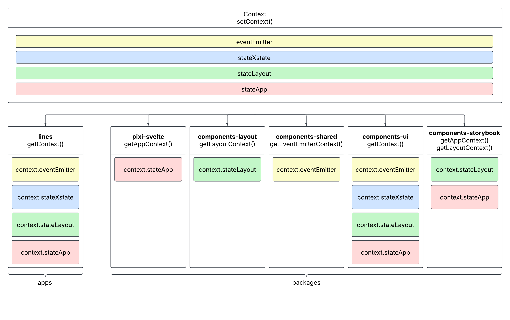

# Context

- [ContextEventEmitter](#contextEventEmitter)
- [ContextLayout](#contextLayout)
- [ContextXstate](#contextXstate)
- [ContextApp](#contextApp)

<a name="contextEventEmitter"></a>
[svelte-context](https://svelte.dev/docs/svelte/context) is a useful feature from svelte especially when a shared state requires some inputs/types to create. Here it shows the structure of context of sample game `/apps/lines`. As showed before, `setContext()` is called at entry level component. For example, `apps/lines/src/routes/+page.svelte` or `apps/lines/src/stories/ComponentsGame.stories.svelte`. It sets four major contexts from the packages by this:

```
// context.ts - Example of setContext in apps

export const setContext = () => {
  setContextEventEmitter<EmitterEvent>({ eventEmitter });
  setContextXstate({ stateXstate, stateXstateDerived });
  setContextLayout({ stateLayout, stateLayoutDerived });
  setContextApp({ stateApp });
};
```

<mark>Different apps and packages require different contexts.</mark>



<a name="contextEventEmitter"></a>

## ContextEventEmitter

`eventEmitter` is created by `packages/utils-event-emitter/src/createEventEmitter.ts`. We have covered eventEmitter in the previous content.

<a name="contextLayout"></a>

## ContextLayout

`stateLayout` and `stateLayoutDerived` are created by `packages/utils-layout/src/createLayout.svelte.ts`. It provides canvasSizes, canvasRatio, layoutType and so on. Because we have a setting `resizeTo: window` for PIXI.Application, we use the sizes of window from [svelte-reactivity](https://svelte.dev/docs/svelte/svelte-reactivity-window) as `canvasSizes`.

For html, the tags will auto-flow by default. However, in the canvas/pixijs we need to set positions manually to avoid overlapping. The importance of LayoutContext is that it provides us the values of boundaries (canvasSizes), device type based on the dimensions (layoutType) and so on. For example:

- Set a pixi-svelte component to the left edge of the canvas:
  - `<Component x={0} />`
- Set a pixi-svelte component to the right edge of the canvas:
  - `<Component x={context.stateLayoutDerived.canvasSizes().width} anchor={{ x: 1: y: 0 }} />`
  - It works when `<App />` is the parent of the component, otherwise it will be determined by its parent `<Container />`.
  - The reason why we set `anchor` is because that the drawing is always go from top-left to bottom-right in pixijs.

```
// createLayout.svelte.ts

import { innerWidth, innerHeight } from 'svelte/reactivity/window';

...

const stateLayout = $state({
  showLoadingScreen: true,
});

const stateLayoutDerived = {
  canvasSizes,
  canvasRatio,
  canvasRatioType,
  canvasSizeType,
  layoutType,
  isStacked,
  mainLayout,
  normalBackgroundLayout,
  portraitBackgroundLayout,
};
```

<a name="contextXstate"></a>

## ContextXstate

`stateXstate` and `stateXstateDerived` are created by `packages/utils-xstate/src/createXstateUtils.svelte.ts`. It provides a few functions to check the state of [finite state machine](https://en.wikipedia.org/wiki/Finite-state_machine), also known as `gameActor`, which is created by `packages/utils-xstate/src/createGameActor.svelte.ts`.

```
// createXstateUtils.svelte.ts

import { matchesState, type StateValue } from 'xstate';

...

const stateXstate = $state({
  value: '' as StateValue,
});

const matchesXstate = (state: string) => matchesState(state, stateXstate.value);

const stateXstateDerived = {
  matchesXstate,
  isRendering: () => matchesXstate(STATE_RENDERING),
  isIdle: () => matchesXstate(STATE_IDLE),
  isBetting: () => matchesXstate(STATE_BET),
  isAutoBetting: () => matchesXstate(STATE_AUTOBET),
  isResumingBet: () => matchesXstate(STATE_RESUME_BET),
  isForcingResult: () => matchesXstate(STATE_FORCE_RESULT),
  isPlaying: () => !matchesXstate(STATE_RENDERING) && !matchesXstate(STATE_IDLE),
};
```

`gameActor`: To avoid using massive "if-else" conditions in the code, we use [npm/xstate](https://www.npmjs.com/package/xstate) to create a [finite state machine](https://en.wikipedia.org/wiki/Finite-state_machine) to handle the complicated logic and states of betting. It provides a few pre-defined mechanics like one-off `bet`, `autoBet` with a count down, `resumeBet` to continue an unfinished bet and so on.

```
// createGameActor.svelte.ts

import { setup, createActor } from 'xstate';

...

const gameMachine = setup({
  actors: {
    bet: intermediateMachines.bet,
    autoBet: intermediateMachines.autoBet,
    resumeBet: intermediateMachines.resumeBet,
    forceResult: intermediateMachines.forceResult,
  },
}).createMachine({
  initial: 'rendering',
  states: {
    [STATE_RENDERING]: stateRendering,
    [STATE_IDLE]: stateIdle,
    [STATE_BET]: stateBet,
    [STATE_AUTOBET]: stateAutoBet,
    [STATE_RESUME_BET]: stateResumeBet,
    [STATE_FORCE_RESULT]: stateForceResult,
  },
});

const gameActor = createActor(gameMachine);
```

<mark>This is highly useful when it comes to the interactions with UI, for example disable the bet button when the a game is playing.</mark>

```
// BetButton.svelte - Example of interaction between xstate and UI

<script lang="ts">
  import { getContext } from '../context';

  const context = getContext();
</script>

<SimpleUiButton disabled={context.stateXstateDerived.isPlaying()} />
```

<a name="contextApp"></a>

## AppContext

`stateApp` is created by `packages/pixi-svelte/src/lib/createApp.svelte.ts`. `loadedAssets` contains the static images, animations and sound data that is processed by `PIXI.Assets.load` with `stateApp.assets`. `loadedAssets` can be digested by pixi-svelte components directly as showed in pixi-svelte component `\<Sprite /\>`(`/packages/pixi-svelte/src/lib/components/Sprite.svelte`).

```
// createApp.svelte.ts

const stateApp = $state({
  reset,
  assets,
  loaded: false,
  loadingProgress: 0,
  loadedAssets: {} as LoadedAssets,
  pixiApplication: undefined as PIXI.Application | undefined,
});
```