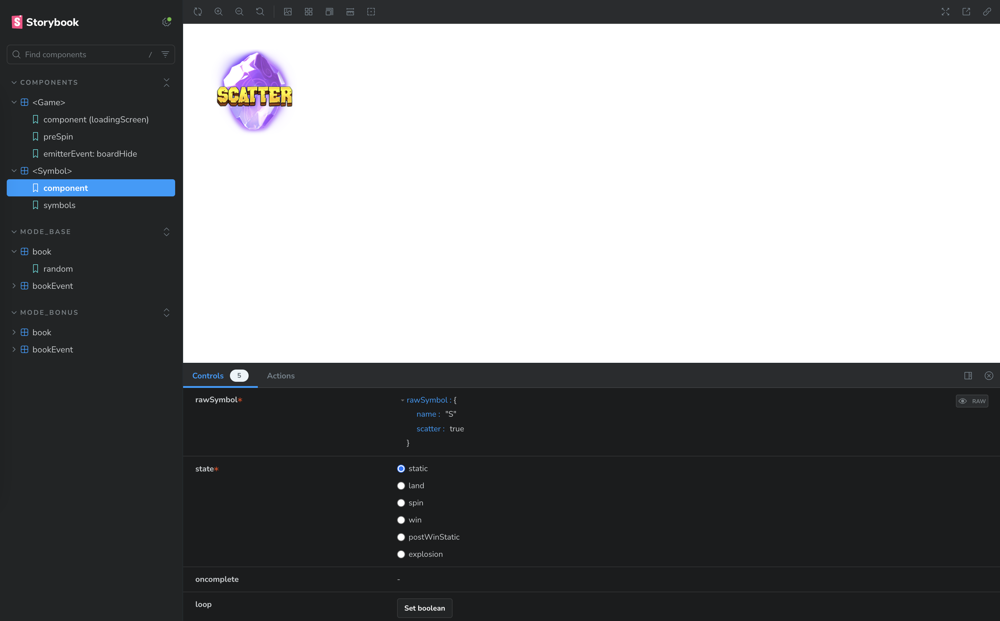
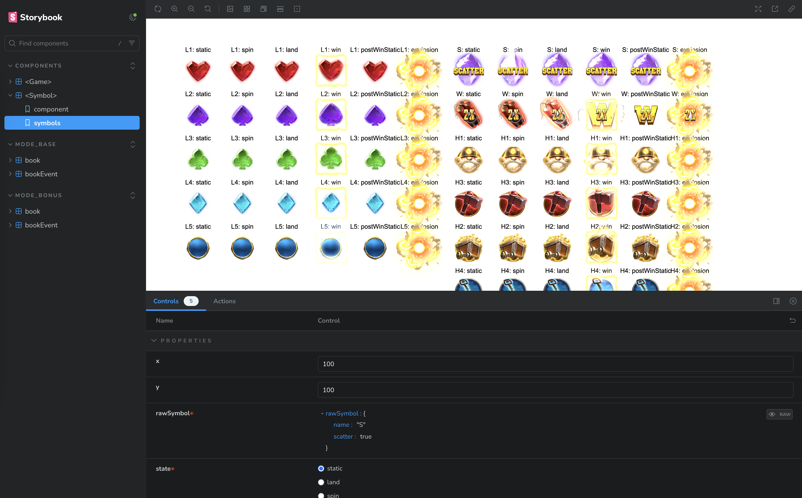

# Explore Storybook

Storybook is a powerful and handy tool to test our games. For example:

- `COMPONENTS/<Game>/component`: It tests the `<Game \/>`(`/apps/lines/src/components/Game.svelte`) component. In this case, it doesn't skip the loading screen.
- `COMPONENTS/<Game>/preSpin`: It tests the `<Game \/>`(`/apps/lines/src/components/Game.svelte`) component with the preSpin function.
- `COMPONENTS/<Game>/emitterEvent`: It tests the `<Game \/>`(`/apps/lines/src/components/Game.svelte`) component with an emitterEvent "boardHide".
- ...
- `COMPONENTS/<Symbol>/component`: It tests the `<Symbol \/>`(`/apps/lines/src/components/Symbol.svelte`) component with controls e.g. state of the symbol.
- `COMPONENTS/<Symbol>/symbols`: It tests the `<Symbol \/>`(`/apps/lines/src/components/Symbol.svelte`) component with all the symbols and all the states.
- ...
- `MODE_BASE/book/random`: It tests the `<Game \/>`(`/apps/lines/src/components/Game.svelte`) component with a random book of base mode.
- `MODE_BASE/bookEvent/reveal`: It tests the `<Game \/>`(`/apps/lines/src/components/Game.svelte`) component with a "reveal" bookEvent of the base mode. It will spin the reels.
- ...
- `MODE_BONUS/book/random`: It tests the `<Game \/>`(`/apps/lines/src/components/Game.svelte`) component with a random book of bonus mode.
- `MODE_BONUS/bookEvent/reveal`: It tests the `<Game \/>`(`/apps/lines/src/components/Game.svelte`) component with a "reveal" bookEvent of the bonus mode. It will spin the reels.
- ...

###

With all the stories above and the stories that created and customised by yourself, <mark>we are able to test the whole game, intermediate components and atomic components.</mark>

<mark>We are also able to test our game with a book, a sequence of bookEvents and a single bookEvent.</mark> If each bookEvent is implemented well with emitterEvents and its story is resolved properly, the game is technically finished.

