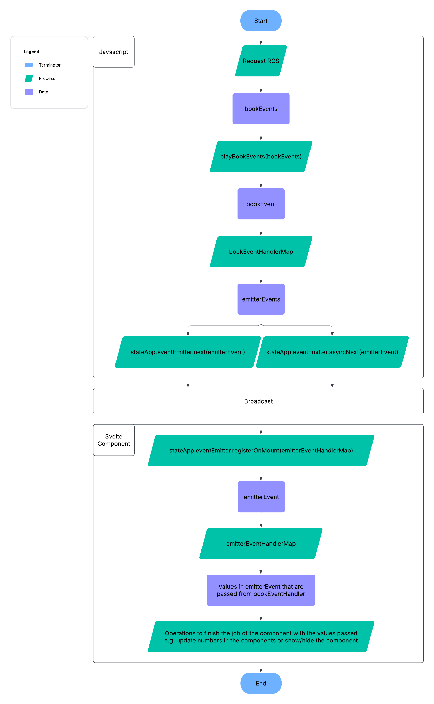

# Flow Chart

Here it is a simplified flow chart of steps how a game is processed after RGS request. The real situation might be more complicated, but it follows the same idea.



<a name="playBookEvents"></a>

## playBookEvents()

This function is created by `packages/utils-book/src/createPlayBookUtils.ts`. It goes through bookEvents one by one, handles each one with async function `playBookEvent()`. It resolves them one after another with `sequence()` in the order of the bookEvents array. <mark>It means the sequence of bookEvents matters eminently and it determines the behaviors of the game.</mark> For example, we don't want to see the "win" before "spin", so we should put "win" after the "spin". This function is also used in the `MODE_<GAME_MODE>/book/random` stories.

- `playBookEvent()`: This is a function that takes in a bookEvent with some context (usually all the bookEvents), then find the bookEventHandler in bookEventHandlerMap based on `bookEvent.type` to process it. This function is also used in the `MODE_<GAME_MODE>/bookEvent/<BOOK_EVENT_TYPE>` stories.

- `sequence()`: This is an async function to achieve resolving async functions/promises one after another. On the contrast, `Promise.all()` will trigger all the async functions/promises together at the same time, which is not what we desire for the sequence of the game.

<a name="bookEvent"></a>

## bookEvent

- `book`: A book is a json data that is returned from the RGS (Remote Game Server) for each game requested. It is mainly composed by bookEvents.

```
// base_books.ts - Example of a base game book

{
  id: 1,
  payoutMultiplier: 0.0,
  events: [
    {
      index: 0,
      type: 'reveal',
      board: [
        [{ name: 'L2' }, { name: 'L1' }, { name: 'L4' }, { name: 'H2' }, { name: 'L1' }],
        [{ name: 'H1' }, { name: 'L5' }, { name: 'L2' }, { name: 'H3' }, { name: 'L4' }],
        [{ name: 'L3' }, { name: 'L5' }, { name: 'L3' }, { name: 'H4' }, { name: 'L4' }],
        [{ name: 'H4' }, { name: 'H3' }, { name: 'L4' }, { name: 'L5' }, { name: 'L1' }],
        [{ name: 'H3' }, { name: 'L3' }, { name: 'L3' }, { name: 'H1' }, { name: 'H1' }],
      ],
      paddingPositions: [216, 205, 195, 16, 65],
      gameType: 'basegame',
      anticipation: [0, 0, 0, 0, 0],
    },
    { index: 1, type: 'setTotalWin', amount: 0 },
    { index: 2, type: 'finalWin', amount: 0 },
  ],
  criteria: '0',
  baseGameWins: 0.0,
  freeGameWins: 0.0,
}
```

- `bookEvent`: A bookEvent is a json data that is one of the element of the `book.events` array.

```
// base_books.ts - Example of a "reveal" bookEvent

{
  index: 0,
  type: 'reveal',
  board: [
    [{ name: 'L2' }, { name: 'L1' }, { name: 'L4' }, { name: 'H2' }, { name: 'L1' }],
    [{ name: 'H1' }, { name: 'L5' }, { name: 'L2' }, { name: 'H3' }, { name: 'L4' }],
    [{ name: 'L3' }, { name: 'L5' }, { name: 'L3' }, { name: 'H4' }, { name: 'L4' }],
    [{ name: 'H4' }, { name: 'H3' }, { name: 'L4' }, { name: 'L5' }, { name: 'L1' }],
    [{ name: 'H3' }, { name: 'L3' }, { name: 'L3' }, { name: 'H1' }, { name: 'H1' }],
  ],
  paddingPositions: [216, 205, 195, 16, 65],
  gameType: 'basegame',
  anticipation: [0, 0, 0, 0, 0],
}

// base_books.ts - Example of a setTotalWin bookEvent

{ index: 1, type: 'setTotalWin', amount: 0 },
```

- `bookEventHandler`: An async function that takes in a bookEvent and do some operations with it. Usually it broadcasts some emitterEvents, so the components will receive and handle.

<a name="bookEventHandlerMap"></a>

## bookEventHandlerMap

An object that the key is `bookEvent.type` and value is a `bookEventHandler`. We can find an example in `/apps/lines/src/game/bookEventHandlerMap.ts`.

```
// bookEventHandlerMap.ts - Example of "updateFreeSpin" bookEventHandler

export const bookEventHandlerMap: BookEventHandlerMap<BookEvent, BookEventContext> = {
  ...,
  updateFreeSpin: async (bookEvent: BookEventOfType<'updateFreeSpin'>) => {
    eventEmitter.broadcast({ type: 'freeSpinCounterShow' });
    eventEmitter.broadcast({
      type: 'freeSpinCounterUpdate',
      current: bookEvent.amount,
      total: bookEvent.total,
    });
  },
  ...,
}
```

- <mark>In simple terms, a book is composed by multiple bookEvents. Different combinations of bookEvents will determine the different behaviours of a game e.g. win/lose, a big/small win, a base/bonus game, 1/10/15 spins and so on.</mark>

<a name="eventEmitter"></a>

## eventEmitter

It achieves [event-driven programming](https://en.wikipedia.org/wiki/Event-driven_programming) for the development. It can either broadcast or subscribe to emitterEvents. It connects the javascript scope and svelte component scope with emitterEvents instead of passing the different states as svelte component props directly. The three most used functions are:

- `eventEmitter.broadcast()`
- `eventEmitter.broadcastAsync()`
- `eventEmitter.subscribeOnMount()`

<a name="emitterEvent"></a>

## emitterEvent

An emitterEvent is a json data that `eventEmitter.broadcast(emitterEvent)` or `eventEmitter.broadcastAsync(emitterEvent)` broadcasts, so that a component which has `eventEmitter.subscribeOnMount(emitterEventHandlerMap)` can receive the data and deal with it in a synchronous or asynchronous way.

<mark>For a game we have many animations, so sometimes we need to "await" for those animations to finish before going to the next step.</mark>

Conceptually a bookEvent is composed by emitterEvents. <mark>Nevertheless, the flexibility lies in that the emitterEvents composing a bookEvent can come from multiple different svelte components.</mark> This way we can achieve and control the interactions and timing between different svelte components for the same bookEvent, ultimately, to achieve our games.

```
// bookEventHandlerMap.ts - Example of an emitterEvent

{
  type: 'freeSpinCounterUpdate',
  current: undefined,
  total: bookEvent.totalFs,
}
```

- `EmitterEventHandler (Synchronous)`: A sync function that takes in an emitterEvent. It usually deals with some sync operations e.g. show/hide component, tidy up, update some numbers and so on.

```
// bookEventHandlerMap.ts - Example of broadcast

eventEmitter.broadcast({
  type: 'freeSpinCounterUpdate',
  current: undefined,
  total: bookEvent.totalFs,
});

// FreeSpinCounter.svelte - Example of receiving

context.eventEmitter.subscribeOnMount({
  ...,
  freeSpinCounterUpdate: (emitterEvent) => {
    if (emitterEvent.current !== undefined) current = emitterEvent.current;
    if (emitterEvent.total !== undefined) total = emitterEvent.total;
  },
  ...,
});
```

- `EmitterEventHandler (Asynchronous)`: An async function that takes in an emitterEvent. It usually deals with some async operations e.g. wait for fading in/out component, wait for animations to finish, wait for numbers to increase/decrease with [svelte-tween](https://svelte.dev/docs/svelte/svelte-motion#Tween) and so on.

```
// bookEventHandlerMap.ts - Example of broadcastAsync

await eventEmitter.broadcastAsync({
  type: 'freeSpinIntroUpdate',
  totalFreeSpins: bookEvent.totalFs,
});

// FreeSpinIntro.svelte - Example of receiving

context.eventEmitter.subscribeOnMount({
  ...,
  freeSpinIntroUpdate: async (emitterEvent) => {
    freeSpinsFromEvent = emitterEvent.totalFreeSpins;
    await waitForResolve((resolve) => (oncomplete = resolve));
  },
  ...,
});
```

<a name="emitterEventHandlerMap"></a>

## emitterEventHandlerMap

An object that the key is `emitterEvent.type` and value is an `emitterEventHandler`. We can find this object in each component. For example, (`/apps/lines/src/components/FreeSpinCounter.svelte`).

- <mark>Each emitterEventHandler can do a lot or a little, but we prefer each emitterEventHandler just doing a minimum job to achieve the duty that is described by its type. This way we follow the [Single Responsibility Principle of SOLID](https://www.digitalocean.com/community/conceptual-articles/s-o-l-i-d-the-first-five-principles-of-object-oriented-design#single-responsibility-principle).</mark> For example, `freeSpinCounterShow` just shows this component and does nothing more.

```
// FreeSpinCounter.svelte and its emitterEventHandlers

<script lang="ts" module>
  export type EmitterEventFreeSpinCounter =
    | { type: 'freeSpinCounterShow' }
    | { type: 'freeSpinCounterHide' }
    | { type: 'freeSpinCounterUpdate'; current?: number; total?: number };
</script>

<script lang="ts">
  ...

  context.eventEmitter.subscribeOnMount({
    freeSpinCounterShow: () => (show = true),
    freeSpinCounterHide: () => (show = false),
    freeSpinCounterUpdate: (emitterEvent) => {
      if (emitterEvent.current !== undefined) current = emitterEvent.current;
      if (emitterEvent.total !== undefined) total = emitterEvent.total;
    },
  });
</script>

<MainContainer>
  ...
</MainContainer>
```