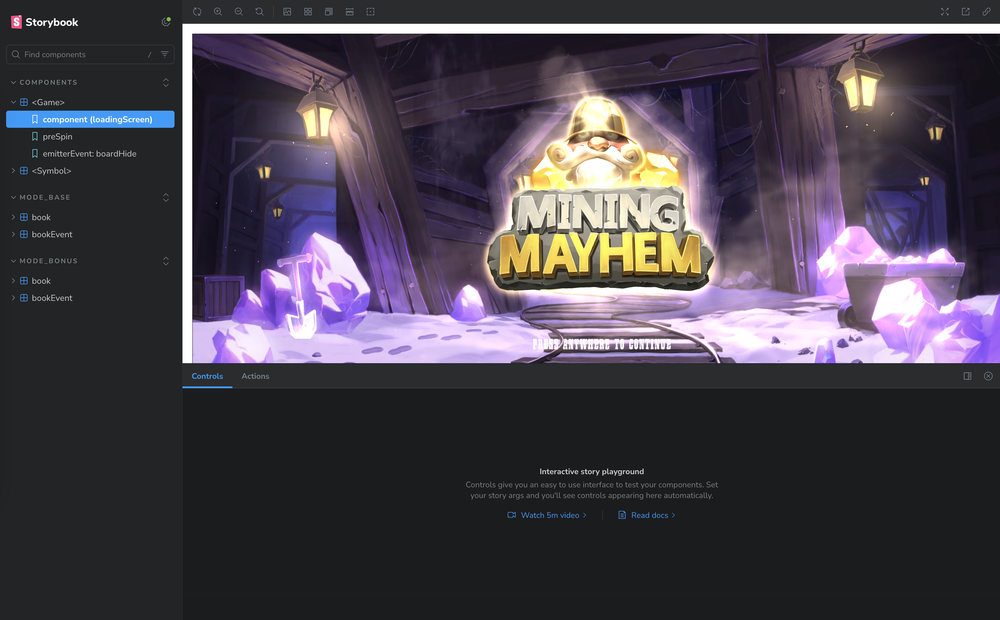
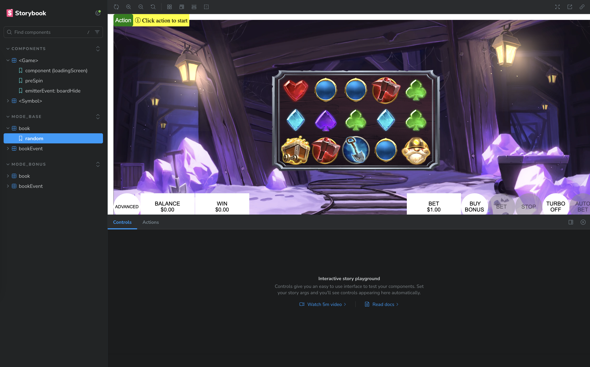

# Get started

Here is a complete tutorial to start our sample games in the storybook. Please ignore those steps that you already know or done.

- It is preferred to use VS Code as IDE. [download](https://code.visualstudio.com/download)
- Install node with version 18.18.0. [download](https://nodejs.org/en/download)

```
# Download and install nvm:
curl -o- https://raw.githubusercontent.com/nvm-sh/nvm/v0.40.1/install.sh | bash

# in lieu of restarting the shell
\. "$HOME/.nvm/nvm.sh"

# Download and install Node.js:
nvm install 18.18.0

# Verify the node versions. Should print "v18.18.0".
node -v
```

- Install pnpm with version 10.5.0.

```
# Install pnpm
npm install pnpm@10.5.0 -g

# Verify the pnpm versions. Should print "v10.5.0"
pnpm -v
```

- Clone the repo to your local in VS Code terminal or others.

```
git clone <REPO_CLONE_URL>
cd web-sdk
```

- Install dependencies.

```
pnpm install
```

- Run `pnpm run storybook --filter=<MODULE_NAME>` in the terminal to see the storybook of a sample game in a TurboRepo way. `<MODULE_NAME>` is the name in the package.json file of a module in apps or packages folders.
- For example, we have `"name": "lines"` in the `/apps/lines/package.json`, so we can find it and run its storybook by:

```
pnpm run storybook --filter=lines
```

- You should see this:


###

- Now switch to `MODE_BASE/book/random` in the left sidebar, you will see an `Action` button appear on the left right conner of the game.



###

- Click on the `Action` button and wait for a base game to finish.
- <mark>Congratulations! You are now in the zone of game development with us now.</mark>
