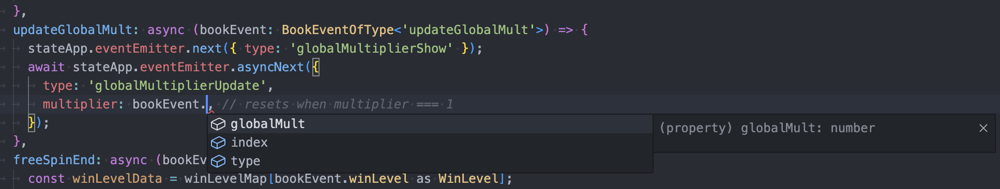

# Steps to Add a New BookEvent

For example, we have a game `/apps/lines` already. Assume that we have added a new bookEvent `updateGlobalMult` to the bonus game mode (`MODE_BONUS`) in math, so that we have a new global multiplier feature for the game. Based on that, here we will go through the steps together to implement this new bookEvent and add it to the game. Along the way we will introduce part of our file structure as well.

- `/apps/lines/src/stories/data/bonus_books.ts`: This file includes the an array of bonus books that story `MODE_BONUS/book/random` will randomly pick at. This is to simulate requesting data from RGS. All we need to do is to copy/paste data from our new math package and format it.a

```
// bonus_books.ts

{
  type: 'updateGlobalMult',
  globalMult: 3,
},
```

- `/apps/lines/src/stories/data/bonus_events.ts`: This file includes the an object of every type of bookEvent that story `MODE_BONUS/bookEvent/<BOOK_EVENT_TYPE>` uses. All we need to do is to copy/paste data from our new math package and format it.

```
// bonus_events.ts

export default {
  ...,
  updateGlobalMult: {
    type: 'updateGlobalMult',
    globalMult: 3,
  },
  ...,
}
```

- `/apps/lines/src/stories/ModeBonusBookEvent.stories.svelte`: This file implements all the sub stories in story set `MODE_BONUS/bookEvent`. With the following code added in this file, you will see the a new story `MODE_BONUS/bookEvent/updateGlobalMult` that is added in our storybook with an `Action` button. Now if we click on it and nothing would happen, but it is a good start because we set up the testing environment first. Next step is to add code of bookEventHandler to handle it.

```
// ModeBonusBookEvent.stories.svelte

<Story
  name="updateGlobalMult"
  args={templateArgs({
    skipLoadingScreen: true,
    data: events.updateGlobalMult,
    action: async (data) => await playBookEvent(data, { bookEvents: [] }),
  })}
/>
```

- `/apps/lines/src/game/typesBookEvent.ts`: This file contains typescript types of all the bookEvents. Let is add the type of our new bookEvent to get the intellisense from typescript for the following step.
  - `type BookEvent` is a <mark>union type</mark> ([typescript union type](https://www.typescriptlang.org/docs/handbook/unions-and-intersections.html)) of BookEvent types.

```
// typesBookEvent.ts

type BookEventUpdateGlobalMult = {
  index: number;
  type: 'updateGlobalMult';
  globalMult: number;
};

export type BookEvent =
  | ...
  | BookEventUpdateGlobalMult
  | ...
;
```

- `/apps/lines/src/game/bookEventHandlerMap.ts`: This file includes all the bookEventHandlers. Let is add a new one for the new bookEvent. Check the intellisense that the previous step brings, it provides a better developer experience.



###

- `/apps/lines/src/components/GlobalMultiplier.svelte`: This file is created as our target svelte component for updateGlobalMulti bookEvent. Technically speaking, all the jobs that is related to global multiplier of the game should only be in this svelte component. Similar to the bookEvent types, let is add the typescript types for new emitterEvents first.
  - `type EmitterEventGlobalMultiplier` is a <mark>union type</mark> of EmitterEvent types.

```
// GlobalMultiplier.svelte

<script lang="ts" module>
  export type EmitterEventGlobalMultiplier =
    | { type: 'globalMultiplierShow' }
    | { type: 'globalMultiplierHide' }
    | { type: 'globalMultiplierUpdate'; multiplier: number };
</script>
```

- `/apps/lines/src/game/typesEmitterEvent.ts`: This file has typescript types of all the emitterEvents of the game. Let is add the type of our new emitterEvents for intellisense.
  - `type EmitterEventGame` is a <mark>union type</mark> of EmitterEvent types.

```
// typesEmitterEvent.ts

...
import type { EmitterEventGlobalMultiplier } from '../components/GlobalMultiplier.svelte';
...

export type EmitterEventGame =
  | ...
  | EmitterEventGlobalMultiplier
  | ...
;
```

- `/apps/lines/src/game/eventEmitter.ts`: This file exports the eventEmitter, it uses the `EmitterEventGame` and other EmitterEvent types to compose `type EmitterEvent`.
  - `type EmitterEvent` is a <mark>union type</mark> of EmitterEvent types.

```
// eventEmitter.ts

...
import type { EmitterEventGame } from './typesEmitterEvent';
export type EmitterEvent = EmitterEventUi | EmitterEventHotKey | EmitterEventGame;
export const { eventEmitter } = createEventEmitter<EmitterEvent>();

```

- `/apps/lines/src/components/GlobalMultiplier.svelte`: Back to our component file, the intellisense is there. Let is add the code to process the values with a spine animation as well.


###

```
// GlobalMultiplier.svelte

<script lang="ts" module>
  export type EmitterEventGlobalMultiplier =
    | { type: 'globalMultiplierShow' }
    | { type: 'globalMultiplierHide' }
    | { type: 'globalMultiplierUpdate'; multiplier: number };
</script>

<script lang="ts">
  ...

  context.eventEmitter.subscribeOnMount({
    globalMultiplierShow: () => (show = true),
    globalMultiplierHide: () => (show = false),
    globalMultiplierUpdate: async (emitterEvent) => {
      console.log(emitterEvent.multiplier)
    },
  });
</script>

<SpineProvider key="globalMultiplier" width={PANEL_WIDTH}>
  ...
  <SpineTrack trackIndex={0} {animationName} />
</SpineProvider>
```

- <mark>Test it individually</mark> `(MODE_BONUS/bookEvent/updateGlobalMult)`: Run storybook and we should see this a new story "updateGlobalMult" has been added.

  - Now click on the `Action` button and we should see the `<GlobalMultiplier \/>` (`/apps/lines/src/components/GlobalMultiplier.svelte`) component animates correctly followed by the "<mark> ⓘ Action is resolved ✅ </mark>" message, otherwise we need to go back to the component and figure out what is wrong until it is resolved.

  - If you find out the component hard to debug, we'd better start creating a new story `COMPONENTS/<GlobalMultiplierSpine>/component`. `<GlobalMultiplierSpine />` component will purely take props and achieve its duty instead of being controlled by emitterEvents. This way it becomes more friendly for testing the component with the storybook controls.

- <mark>Test it in books</mark> `(MODE_BONUS/book/random)`: Final step is to test it in a book environment by switching to this book story. In a previous step we have updated `/apps/lines/src/stories/data/bonus_books.ts`, so the new bookEvent will appear if we keep hitting the `Action` button in this story.
