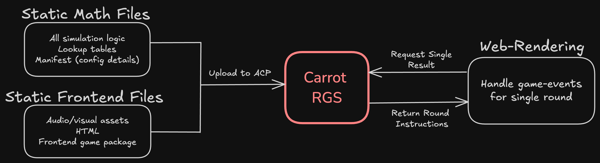

# **Stake Development Kit**
### Powered by **[CarrotRGS](https://carrotgaming.io/)**

## **Complex Games Made Easy**

The Stake Development Kit is a comprehensive framework designed to simplify the creation, simulation, and optimization of slot games. Whether you're an independent developer or part of a dedicated studio, the SDK empowers you to bring your gaming vision to life with precision and efficiency. By leveraging the Carrot Remote Gaming Server (RGS), developers can seamlessly integrate their games on [Stake.com](https://stake.com), facilitating smooth and scalable deployments.

### **What Does the SDK Offer?**

The SDK is an optional software package handling both the client-side rendering of games in-browser, and the generation of static files containing all possible game results.

1. **Math Framework**: A Python-based engine for defining game rules, simulating outcomes, and optimizing win distributions. It generates all necessary backend and configuration files, lookup tables, and simulation results.
   
2. **Frontend Framework**: A PixieJS/Svelte-based toolkit for creating visually engaging slot games. This component integrates seamlessly with the math engine's outputs, ensuring consistency between game logic and player experience.

## **Stake Engine Game Format Criteria**

For verification, testing and security purposes, games uploaded to Stake Engine must consist of static files. Developers utilizing their own frontend and/or math solutions are welcome to upload compatible file-formats to the Admin Control Panel (ACP). All possible game-outcomes must be contained within compressed game-files, typically separated out by modes. Each outcome must be mapped to a corresponding CSV file summarizing a single game-round by a simulation number, probability of selection, and final payout multiplier. When a betting round is initiated a simulation number is selected at a frequency proportional to the simulation weighting, and the corresponding game events are returned though the */play* API response.

