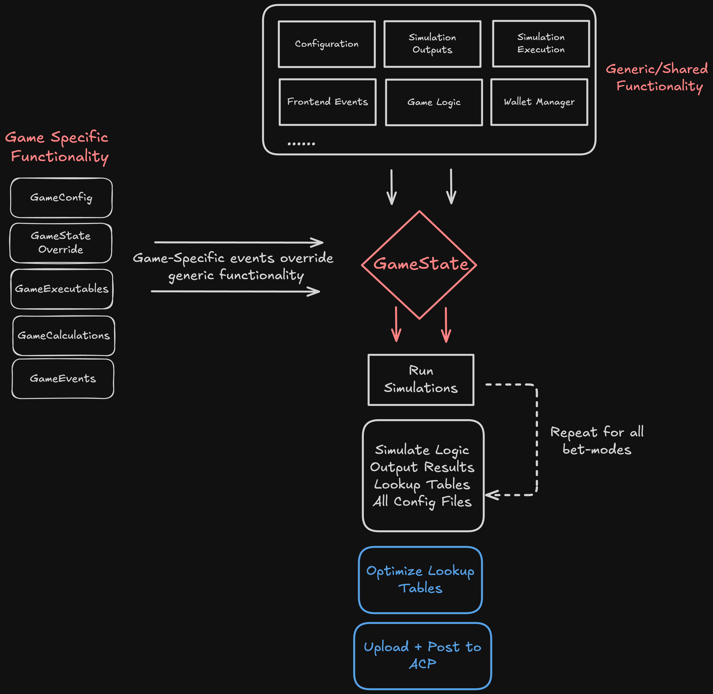

# The State Machine

## Introduction

The **GameState** class serves as the central hub for managing all aspects of a simulation batch. It handles:

- Simulation parameters
- Game modes
- Configuration settings
- Simulation results
- Output files

The entry point for all game simulations is the `run.py` file, which initializes parameters through the [Config](../source_section/config_info.md) class and creates a [GameState](../source_section/state_info.md) object. The **GameState** ensures consistency across simulations and provides a unified structure for managing game logic and outputs.

### Key Responsibilities of `GameState`

#### Simulation Configuration
- Compression
- Tracing
- Multithreading
- Output files
- Cumulative win manager

#### Game Configuration
- Betmode details (costs, names, etc.)
- Paytable
- Symbols
- Reelsets

These **global `GameState` attributes** remain consistent across all game modes and simulations. When a simulation runs, the `run_spin()` method creates a sub-instance of the **GeneralGameState**, allowing modifications to game data directly through the `self` object. This design reduces the need for passing objects between functions, streamlining game logic development.

At a high level, the structure of the engine is shown below:  


### Extending Core Functionality

The `GameState` class acts as a super-class containing core functionality. Custom games can extend or override this functionality using Python's Method Resolution Order (MRO). Once simulations are complete, the relevant output files are generated sequentially for each BetMode. These outputs can then be optimized and uploaded to the Admin Control Panel (ACP).

---

## Class Inheritance

### Why Use Class Inheritance?

Class inheritance ensures flexibility, allowing developers to access core functions while customizing specific behaviors for each game. Core functions are defined in the [Source Files](../source_section/win_manager.md) and can be overridden at the game level.


#### **GameStateOverride (game/game_override.py)**
This class is the first in the **Method Resolution Order (MRO)** and is responsible for modifying or extending actions from the `state.py` file. For example, all sample games override the `reset_book()` function to accommodate game-specific parameters:

```python
def reset_book(self):
    super().reset_book()
    self.reset_grid_mults()
    self.reset_grid_bool()
    self.tumble_win = 0
```


#### **GameExecutables (game/game_executables.py)**

This class groups commonly used game actions into executable functions. These functions can be overridden to introduce new mechanics at the game level. For example, triggering freespins based on scatter symbols:

```python
config.freespin_triggers = {3: 8, 4: 10, 5: 12}

def update_freespin_amount(self, scatter_key: str = "scatter") -> None:
    self.tot_fs = self.config.freespin_triggers[self.gametype][self.count_special_symbols(scatter_key)]
    fs_trigger_event(self, basegame_trigger=True, freegame_trigger=False)
```

However in the `0_0_scatter` sample game, we would instead want to assign the total spins to be 2x the number of active Scatters. Therefore we can override the function in the `GameExecutables` class:

```python
def update_freespin_amount(self, scatter_key: str = "scatter"):
    self.tot_fs = self.count_special_symbols(scatter_key) * 2
    fs_trigger_event(self, basegame_trigger=basegame_trigger, freegame_trigger=freegame_trigger)
```


#### **GameCalculations (games/game_calculations.py)**
This class handles game-specific calculations, inheriting from **GameExecutables**.

## Books and Libraries
### **What is a "Book"?**
A "book" represents a single simulation result, storing:
- The payout multiplier
- Events triggered during the round
- Win conditions

Each simulation generates a Book object, which is stored in a library. The library is a collection of all books generated during a simulation batch. These books are attached to the global GameState object and are used for further analysis and optimization.

Example JSON structure:
```json
[
    {
        "id": int,
        "payoutMultiplier": float,
        "events": [ {}, {}, {} ],
        "criteria": str,
        "baseGameWins": float,
        "freeGameWins": float
    }
]
```

### Resetting the Book
At the start of a simulation, the book is reset to ensure a clean state:
```python
def reset_book(self) -> None:
    self.book = {
        "id": self.sim + 1,
        "payoutMultiplier": 0.0,
        "events": [],
        "criteria": self.criteria,
    }
```

## Lookup Tables
### What are Lookup Tables? ###

Lookup tables provide a summary of all simulation payouts, offering a convenient way to calculate win distribution properties and Return To Player (RTP) values. Each table is stored as a CSV file and contains the following columns:

| Simulation Number | Simulation Weight | Payout Multiplier |
| ----------------- | ----------------- | ------------------|
|       1           |          1        |        0.0        |
|       2           |          1        |        92.3       |
|       ...         |          ...      |        ...        |


The **payoutMultipler** attached to a **book** represents the final amount paid to the player, inclusive or *basegame* and *freegame* wins. The **LookUpTable** *csv* file is a summary of all simulation payouts. This provides a convenient way to calculate win distribution properties and Return To Player calculations. All lookup tables will be of the format:


Purpose of Lookup Tables

- Win Distribution Analysis: Analyze payout distributions across simulations.
- RTP Calculation: Calculate the overall RTP for a game mode.
- Optimization: Serve as input for the optimization algorithm, which adjusts simulation weights to achieve desired payout characteristics.


File Naming Convention

- Initial Lookup Tables: lookUpTable_mode.csv
- Optimized Lookup Tables: lookUpTable_mode_0.csv

The optimization algorithm modifies the weight values in the lookup table, which are initially set to 1. These optimized tables are then used for further analysis or deployment.
