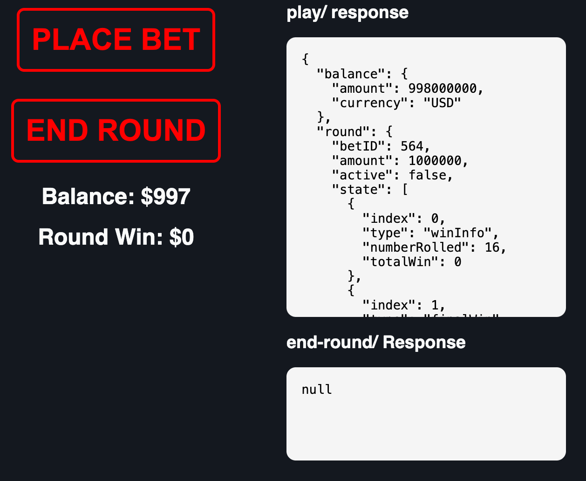

# Getting Started with RGS Responses

This brief tutorial is intended to get you up and running with the RGS using a simple game called *fifty-fifty*. 

### Game Overview

The rules are straightforward:
- You request a response from the RGS’s `/play` API.
- You have a 50/50 chance of either:

  - **2x** your bet back
  - Losing your **1x** bet.

Your **balance** is displayed alongside the outcome of the previously completed round. The JSON response for each round is shown on the right-hand side of the screen.

If your **win is greater than 0**, you’ll need to manually call the `/end-round` API to finalize the bet—just like in a custom frontend implementation.

> For more information, see [RGS Technical Details](../rgs_docs/RGS.md)

---

## Simple Math Results

Navigate to the `math-sdk/games/fifty_fifty/` directory and execute the `run.py` script. This will generate:

- A **Zstandard-compressed** set of simulation results
- A **lookup table** matching each result to its simulation
- The required `index.json` file

All necessary files to publish the game to the **Stake Engine** will be placed in `library/publish_files/`.

---

## Simple Frontend Implementation

We’ll use **Svelte 5** bundled with **Vite** to create a static frontend. We'll initialize the project using **Node Package Manager (NPM)** and optionally **Node Version Manager (NVM)**.

> **Note**: This guide assumes you are using NPM version `v22.16.0`.

### Setup Steps

1. **Create the Vite project**:
    `npm create vite@latest`

2. **Edit the `vite.config.ts` file**:
    Make sure the defineConfig function includes: `base: "./"` (under *plugins*),

3. **Replace styles and main component**:
    - Copy the contents of [`css.txt`](css.txt) into your generated `app.css`
    - Replace the contents of [`app_svelte.txt`](app_svelte.txt) into: `src/App.svelte`

4. **Build the project**:
    `yarn build`

5. **Deploy**:
    - Upload the contents of the `dist/` folder to the Stake Engine under *frontend files*

---

## What This Frontend Does

This simple Svelte app will:

- Authenticate your session with the RGS
- Request a response from the `/play` API
- (If applicable) Call the `/end-round` API to finalize a win

Once the math/frontend files have been uploaded to Stake Engine, launcing the game should result in the following:

Pressing ***Place BET*** will populate the *play/ response* field with the RGS game round structure. 
If the round-win is >0, press ***END ROUND*** to finalise the bet, which will subsequently update your balance and close the bet.