# Web SDK

This is a web sdk that is convenient for you to develop a game in a declarative way. It is an optional way to build and launch your games on with [Stake Engine](https://engine.stake.com/) with some easy steps. It is powered by Svelte 5, PixiJS 8 and TurboRepo.

- How to use: To have 100% freedom to any source code from this repo, start your own codebase based on this repo. You can change any source code as you need.


# Table of Contents

- [Get Started](#getStarted)
  - [Installation](#installation)
  - [Run in Storybook](#runInStorybook)
  - [Run in DEV Mode](#runInDevMode) 
  - [Build a Game](#buildAGame) 
  - [Launch a Game](#launchAGame) 
- [FAQ](#faq)
- [Dependencies](#dependencies)
- [Explore Storybook](#exploreStorybook)
- [Flow Chart](#flowChart)
  - [playBookEvents()](#playBookEvents)
  - [bookEvent](#bookEvent)
  - [bookEventHandlerMap](#bookEventHandlerMap)
  - [eventEmitter](#eventEmitter)
  - [emitterEvent](#emitterEvent)
  - [emitterEventHandlerMap](#emitterEventHandlerMap)
- [Task Breakdown](#taskBreakdown)
- [Steps to Add a New BookEvent](#steps)
- [File Structure](#fileStructure)
  - [/apps](#apps)
  - [/packages](#packages)
- [Context](#context)
  - [ContextEventEmitter](#contextEventEmitter)
  - [ContextLayout](#contextLayout)
  - [ContextXstate](#contextXstate)
  - [ContextApp](#contextApp)
- [UI](#ui)
- [Internationalisation](#internationalisation)

<a name="getStarted"></a>

# Get started

Here is a complete tutorial to start with one of our sample games from storybook running and local test to build and launch it on [Stake Engine](https://engine.stake.com/). Please ignore those steps that you already know or done.

<a name="installation"></a>

## Installation
We use [VSCode](https://code.visualstudio.com/download) as IDE but this is optional and it is up to you.

- Install node with version 22.16.0. [download](https://nodejs.org/en/download)

```
# Download and install nvm:
curl -o- https://raw.githubusercontent.com/nvm-sh/nvm/v0.40.1/install.sh | bash

# in lieu of restarting the shell
\. "$HOME/.nvm/nvm.sh"

# Download and install Node.js:
nvm install 22.16.0

# Verify the node versions. Should print "v22.16.0".
node -v
```

- Install pnpm with version 10.5.0.

```
# Install pnpm
npm install pnpm@10.33.0 -g

# Verify the pnpm versions. Should print "v10.33.0"
pnpm -v
```

- Clone the repo to your local in VS Code terminal or others.

```
git clone https://github.com/StakeEngine/web-sdk.git
cd web-sdk
```

- Install dependencies.

```
pnpm install
```

WIth out any error messages showing up, you are good to continue.

<a name="runInStorybook"></a>

## Run in Storybook

```
pnpm run storybook --filter=lines
```

- Run `pnpm run storybook --filter=<MODULE_NAME>` in the terminal to see the storybook of a sample game in a TurboRepo way. `<MODULE_NAME>` is the name in the package.json file of a module in apps or packages folders.
- For example, we have `"name": "lines"` in the [apps/lines/package.json](/apps/lines/package.json), so we can find it and run its storybook.
- For Windows users, you might need to add the script with "cross-env" to make it work:
```
"storybook": "cross-env PUBLIC_CHROMATIC=true storybook dev -p 6001",
```
- You should see this:


- Now switch to `MODE_BASE/book/random` in the left sidebar, you will see an `Action` button appear on the left right conner of the game.

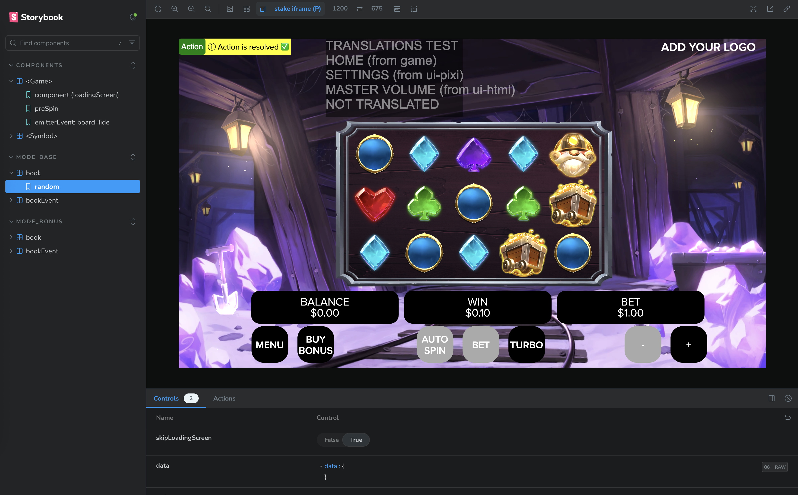

- Click on the `Action` button and wait for a base game to finish.
- Now you are having a game running locally in the storybook.

<a name="runInDevMode"></a>

## Run in DEV Mode
```
pnpm run dev --filter=lines
```
- Open up the url showed in the terminal, you should see this:

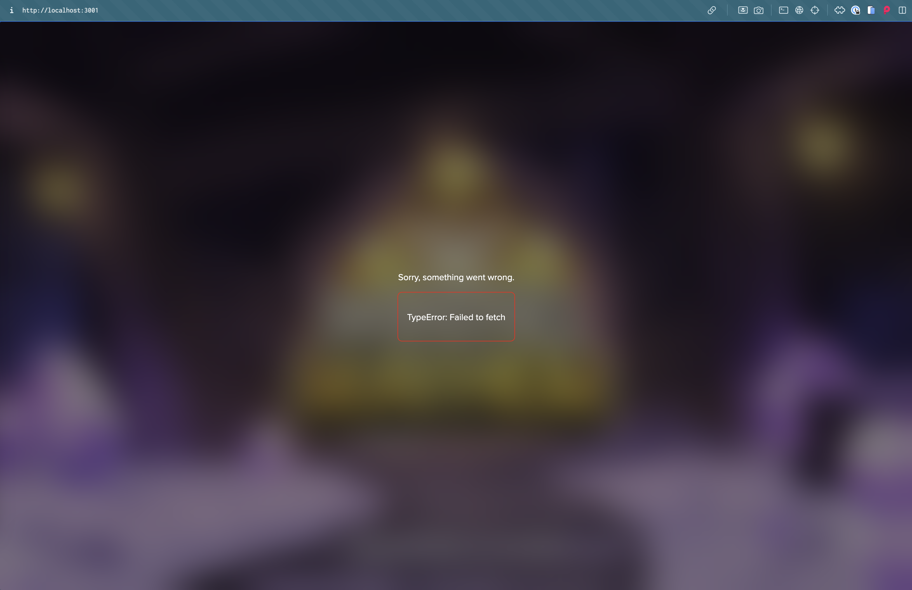

- It is all good to have that error screen for now, because we have not connected to the RGS with DEV mode. We will show you how to do that in the launch-a-game step.

- For more information about how the authentication is handled, please refer to [Authenticate.svelte](https://github.com/StakeEngine/web-sdk/blob/main/packages/components-shared/src/components/Authenticate.svelte)

<a name="buildAGame"></a>

## Build a game
```
pnpm run build --filter=lines
```

- You should see an `index.html` output here `apps/lines/.svelte-kit/output/prerendered/pages/index.html`.

- Create a new folder anywhere you prefer and put the `index.html` file there. For example:

```
build
  |-index.html
```

- Then copy/paste everything in `apps/lines/.svelte-kit/output/client` to the same folder like:

```
build
  |-index.html
  |-_app
  |-assets
  |-favicon.svg
  |-loader.gif
  |-stake-engine-loader.gif
```
- Now you are ready to upload a game!

<a name="launchAGame"></a>

## Launch a game

- Login [Stake Engine](https://engine.stake.com/) account. Go to `Files` page of a game. Import files to upload your the frontend by selecting the whole build folder.

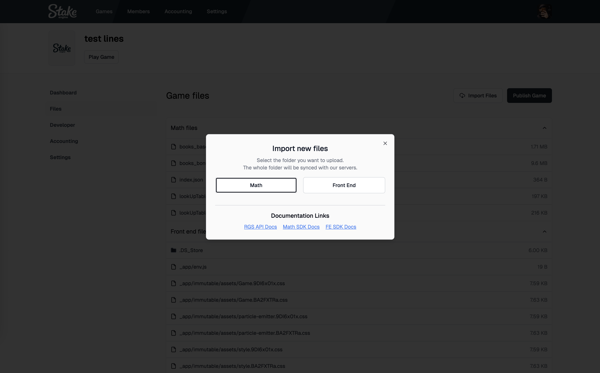

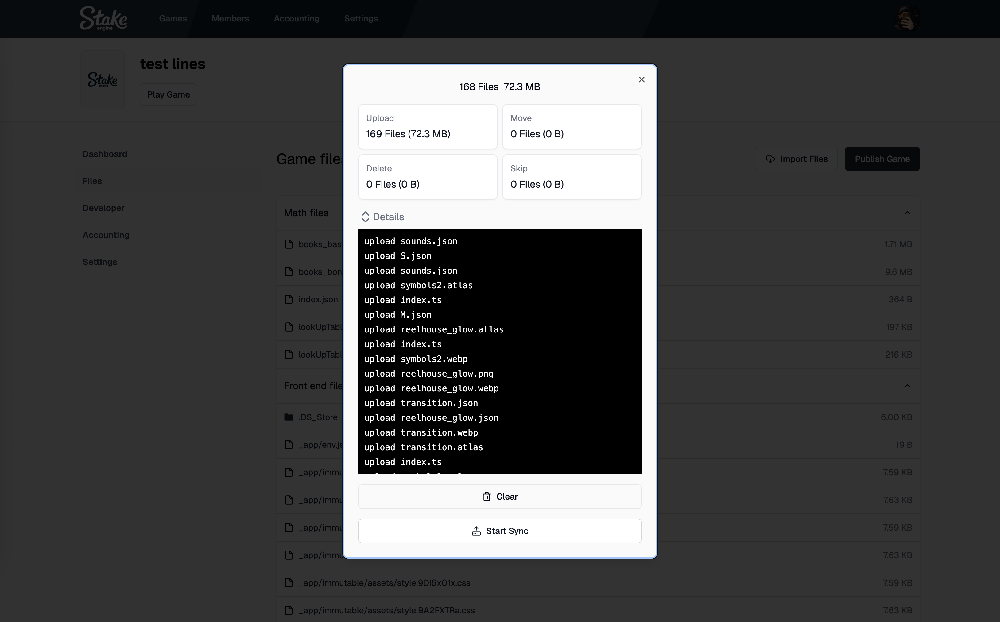

- Then remember to click on the `Publish Game` button then select Front End.

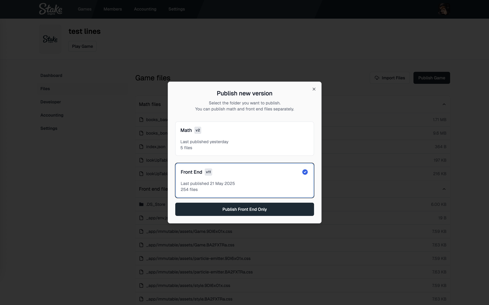

- Then go to the `Developer` page, click on `Start game session` button and click on `Launch in New Tab` button.


- A game is live with a staging environment and you can play with all the buttons.

- Check the query string in the URL and those are the values required to connect to the RGS.

- Now you can go back to the DEV mode and copy/paste the query string in the url and play it locally.

Congratulations! You've completed the tutorial. You can explore the more content in the following documentation for details.

<a name="faq"></a>

# FAQ
- Q: Would it be possible to use a different programming language or framework, such as using Pixi.js only without Svelte?
  - A: You can use anything as long as it compiles to a static website, it is only recommended to use the web-sdk for the easiest development and integration experience as everything is already set up for you, but you can also just fork it or take certain parts of it.

- Q: If we use our own UI/Web SDK, how can we pass configuration data into it?
  - A: About how we handle authentication, configuration, jurisdiction and so on, you can find the answers and an example here: [Authenticate.svelte](https://github.com/StakeEngine/web-sdk/blob/main/packages/components-shared/src/components/Authenticate.svelte)

- Q: Do you have any specific policies (or methods) for handling currencies?
  - A: Check the function "numberToCurrencyString" in "packages/utils-shared/amount.ts", you will find that any currency that can be handled by "i18n.number" is supported. The currency will be passed in from the authentication request like this "stateBet.currency = authenticateData.balance.currency;". Two special currencies from the social casino like `stake.us` will be handled by "NO_LOCALISATION_CURRENCY_MAP".

- Q: As we are using our own game engine and integrating to RGS with the Web SDK as references. Is there a preference to when "end-round" API gets called? After the winning animation is done or it can be called even before the animations is finished.
  - A: "end-round" should be called with different timing for different types of bet. Whether a bet can be resumed from the authenticate request is determined by when the "end-round" is called.

```
packages/utils-xstate/src/createPrimaryMachines.ts

const BET_TYPE_METHODS_MAP = {
    noWin: {
        newGame: async () => undefined,
        endGame: async () => undefined,
    },
    singleRoundWin: {
        newGame: async () => {
            const endRoundData = await handleRequestEndRound();
            if (endRoundData?.balance) {
                balanceAmountFromApiHolder = endRoundData.balance.amount;
            }
        },
        endGame: async () => {
            if (balanceAmountFromApiHolder !== null) {
                handleUpdateBalance({ balanceAmountFromApi: balanceAmountFromApiHolder });
                balanceAmountFromApiHolder = null;
            }
        },
    },
    bonusWin: {
        newGame: async () => undefined,
        endGame: async () => {
            const data = await handleRequestEndRound();
            if (data?.balance) {
                handleUpdateBalance({ balanceAmountFromApi: data.balance.amount });
                balanceAmountFromApiHolder = null;
            }
        },
    },
} as const;
```

- Q: From what I see, most of the animated graphics seem to be spine, is their any other alternatives that you know of, besides spine?
  - A: Spritesheet animation is a good alternative.
Check out the example of spritesheet animation here: [SpriteSheet.stories.svelte](https://github.com/StakeEngine/web-sdk/blob/main/packages/pixi-svelte-storybook/src/stories/SpriteSheet.stories.svelte)

- Q: Is there a mechanism to switch from a game type (i.e. lines) to another game type (i.e. cluster) as a mechanic?
  - A: It's easy. What you can do:
    - Create a new "cluster" board in "src/game/stateGame.ts"
    - Add a new bookEvent in your math to tell the game to switch from a "lines" board to a "cluster" board. (Whatever data shape that you need)
    - Add this bookEvent in your "bookEventHandlerMap" and create emitterEvents
    - In "src/components/Board.svelte" subscribe according emitterEvents and then do the switching in a emitterEventHandler

    From this example, it shows you that you can basically do anything you want to achieve through this pattern.
    - Create a bookEvent
    - Add it to bookEventHandlerMap and create emitterEvents
    - Subscribe emitterEvents in a svelte component
    - Do anything you want

- Q: What are the requirements to launch the same game on social casinos like [stake.us](https://stake.us)?
  - A: You will need to add a different set of text for your UI when `social=true` in the query string. For example 'BET' to 'SPIN'. Check the example in the codebase here `packages/components-ui-pixi/src/i18n/i18nDerived.ts`

- Q: When updating things in packages/pixi-svelte, it doesn't seem to take effect. Why is that?
  - A: It's because the pixi-svelte is using the built version, which is described in the (package.json).main. Built it again after anything is changed in the folder.
  ```
  pnpm run build --filter=pixi-svelte
  ```
- Q: Loading time for Storybook on Windows is insanely long, what can I do?
  - A: From the information we have collected, we found the initial loading is slow on windows for storybook. Sometimes it takes up to 15 minutes to finish the initial loading, but once it's loaded switching between the stories is much quicker. The hot reloading can take effect for any changes on fly. We strongly suggest the developers to implement each piece of a game in storybook as task breakdown, it will make your development much easier and quicker. So patience is the answer for the time being.

<a name="dependencies"></a>

# Dependencies

Besides basic web skills (html, css and javascript), here it shows a list of [npm](https://www.npmjs.com) dependencies of this repo. It would be great to start with understanding them before kicking off [Get Started](#getStarted).

- pixijs: https://www.npmjs.com/package/pixi.js and [more...](https://pixijs.download/release/docs/index.html)
- svelte: https://www.npmjs.com/package/svelte and [more...](https://svelte.dev/docs/svelte/overview)
- turborepo: https://www.npmjs.com/package/turbo and [more...](https://turbo.build/repo/docs)
- pixi-svelte: https://www.npmjs.com/package/pixi-svelte and [more...](https://github.com/qk0106/pixi-svelte-storybook)
  - This is an in-house [npm](https://www.npmjs.com) package. It combines pixi and svelte together and uses pixijs in a declarative way.
- sveltekit: https://www.npmjs.com/package/@sveltejs/kit and [more...](https://svelte.dev/docs/kit/introduction)
- storybook: https://www.npmjs.com/package/storybook and [more...](https://storybook.js.org/tutorials/intro-to-storybook/svelte/en/get-started/)
- xstate: https://www.npmjs.com/package/xstate and [more...](https://stately.ai/docs/)
- typescript: https://www.npmjs.com/package/typescript and [more...](https://www.typescriptlang.org/docs/)
- pnpm: https://www.npmjs.com/package/pnpm and [more...](https://pnpm.io/installation)

<a name="exploreStorybook"></a>

# Explore Storybook

Storybook is a powerful and handy tool to test our games. For example:

- `COMPONENTS/<Game>/component`: It tests the [<Game \/>](/apps/lines/src/components/Game.svelte) component. In this case, it doesn't skip the loading screen.
- `COMPONENTS/<Game>/preSpin`: It tests the [<Game \/>](/apps/lines/src/components/Game.svelte) component with the preSpin function.
- `COMPONENTS/<Game>/emitterEvent`: It tests the [<Game \/>](/apps/lines/src/components/Game.svelte) component with an emitterEvent "boardHide".
- ...
- `COMPONENTS/<Symbol>/component`: It tests the [<Symbol \/>](/apps/lines/src/components/Symbol.svelte) component with controls e.g. state of the symbol.
- `COMPONENTS/<Symbol>/symbols`: It tests the [<Symbol \/>](/apps/lines/src/components/Symbol.svelte) component with all the symbols and all the states.
- ...
- `MODE_BASE/book/random`: It tests the [<Game \/>](/apps/lines/src/components/Game.svelte) component with a random book of base mode.
- `MODE_BASE/bookEvent/reveal`: It tests the [<Game \/>](/apps/lines/src/components/Game.svelte) component with a "reveal" bookEvent of the base mode. It will spin the reels.
- ...
- `MODE_BONUS/book/random`: It tests the [<Game \/>](/apps/lines/src/components/Game.svelte) component with a random book of bonus mode.
- `MODE_BONUS/bookEvent/reveal`: It tests the [<Game \/>](/apps/lines/src/components/Game.svelte) component with a "reveal" bookEvent of the bonus mode. It will spin the reels.
- ...

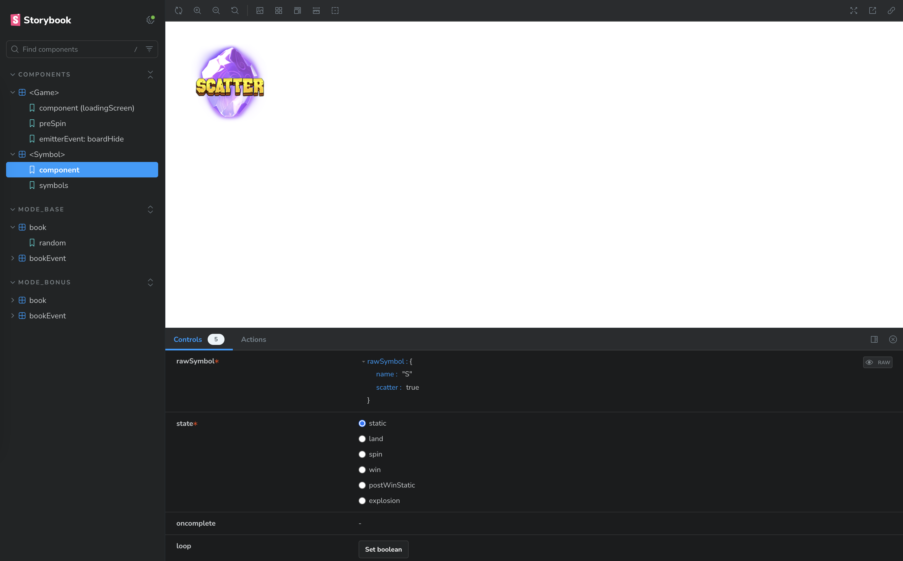
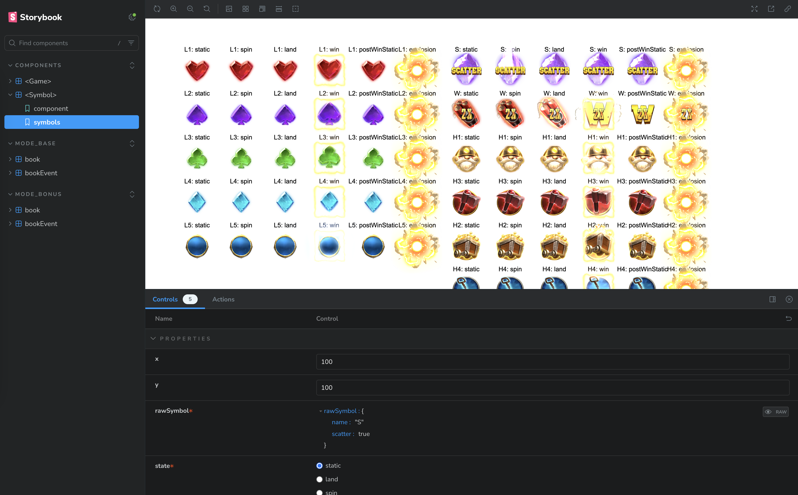

###

With all the stories above and the stories that created and customised by yourself, <mark>we are able to test the whole game, intermediate components and atomic components.</mark>

<mark>We are also able to test our game with a book, a sequence of bookEvents and a single bookEvent.</mark> If each bookEvent is implemented well with emitterEvents and its story is resolved properly, the game is technically finished.

<a name="flowChart"></a>

# Flow Chart

Here it is a simplified flow chart of steps how a game is processed after RGS request. The real situation might be more complicated, but it follows the same idea.

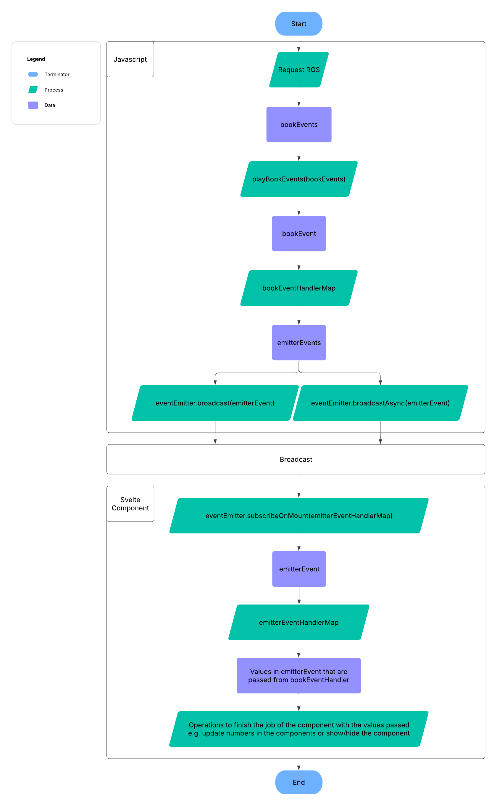

<a name="playBookEvents"></a>

## playBookEvents()

This function is created by [packages/utils-book/src/createPlayBookUtils.ts](/packages/utils-book/src/createPlayBookUtils.ts). It goes through bookEvents one by one, handles each one with async function `playBookEvent()`. It resolves them one after another with `sequence()` in the order of the bookEvents array. <mark>It means the sequence of bookEvents matters eminently and it determines the behaviors of the game.</mark> For example, we don't want to see the "win" before "spin", so we should put "win" after the "spin". This function is also used in the `MODE_<GAME_MODE>/book/random` stories.

- `playBookEvent()`: This is a function that takes in a bookEvent with some context (usually all the bookEvents), then find the bookEventHandler in bookEventHandlerMap based on `bookEvent.type` to process it. This function is also used in the `MODE_<GAME_MODE>/bookEvent/<BOOK_EVENT_TYPE>` stories.

- `sequence()`: This is an async function to achieve resolving async functions/promises one after another. On the contrast, `Promise.all()` will trigger all the async functions/promises together at the same time, which is not what we desire for the sequence of the game.

<a name="bookEvent"></a>

## bookEvent

- `book`: A book is a json data that is returned from the RGS (Remote Game Server) for each game requested. It is randomly picked from over a million of books, which is [math](https://stakeengine.github.io/math-sdk/math_docs/general_overview/). It is mainly composed by bookEvents.

```
// base_books.ts - Example of a base game book

{
  id: 1,
  payoutMultiplier: 0.0,
  events: [
    {
      index: 0,
      type: 'reveal',
      board: [
        [{ name: 'L2' }, { name: 'L1' }, { name: 'L4' }, { name: 'H2' }, { name: 'L1' }],
        [{ name: 'H1' }, { name: 'L5' }, { name: 'L2' }, { name: 'H3' }, { name: 'L4' }],
        [{ name: 'L3' }, { name: 'L5' }, { name: 'L3' }, { name: 'H4' }, { name: 'L4' }],
        [{ name: 'H4' }, { name: 'H3' }, { name: 'L4' }, { name: 'L5' }, { name: 'L1' }],
        [{ name: 'H3' }, { name: 'L3' }, { name: 'L3' }, { name: 'H1' }, { name: 'H1' }],
      ],
      paddingPositions: [216, 205, 195, 16, 65],
      gameType: 'basegame',
      anticipation: [0, 0, 0, 0, 0],
    },
    { index: 1, type: 'setTotalWin', amount: 0 },
    { index: 2, type: 'finalWin', amount: 0 },
  ],
  criteria: '0',
  baseGameWins: 0.0,
  freeGameWins: 0.0,
}
```

- `bookEvent`: A bookEvent is a json data that is one of the element of the `book.events` array.

```
// base_books.ts - Example of a "reveal" bookEvent

{
  index: 0,
  type: 'reveal',
  board: [
    [{ name: 'L2' }, { name: 'L1' }, { name: 'L4' }, { name: 'H2' }, { name: 'L1' }],
    [{ name: 'H1' }, { name: 'L5' }, { name: 'L2' }, { name: 'H3' }, { name: 'L4' }],
    [{ name: 'L3' }, { name: 'L5' }, { name: 'L3' }, { name: 'H4' }, { name: 'L4' }],
    [{ name: 'H4' }, { name: 'H3' }, { name: 'L4' }, { name: 'L5' }, { name: 'L1' }],
    [{ name: 'H3' }, { name: 'L3' }, { name: 'L3' }, { name: 'H1' }, { name: 'H1' }],
  ],
  paddingPositions: [216, 205, 195, 16, 65],
  gameType: 'basegame',
  anticipation: [0, 0, 0, 0, 0],
}

// base_books.ts - Example of a setTotalWin bookEvent

{ index: 1, type: 'setTotalWin', amount: 0 },
```

- `bookEventHandler`: An async function that takes in a bookEvent and do some operations with it. Usually it broadcasts some emitterEvents, so the components will receive and handle.

<a name="bookEventHandlerMap"></a>

## bookEventHandlerMap

An object that the key is `bookEvent.type` and value is a `bookEventHandler`. We can find an example in [apps/lines/src/game/bookEventHandlerMap.ts](/apps/lines/src/game/bookEventHandlerMap.ts).

```
// bookEventHandlerMap.ts - Example of "updateFreeSpin" bookEventHandler

export const bookEventHandlerMap: BookEventHandlerMap<BookEvent, BookEventContext> = {
  ...,
  updateFreeSpin: async (bookEvent: BookEventOfType<'updateFreeSpin'>) => {
    eventEmitter.broadcast({ type: 'freeSpinCounterShow' });
    eventEmitter.broadcast({
      type: 'freeSpinCounterUpdate',
      current: bookEvent.amount,
      total: bookEvent.total,
    });
  },
  ...,
}
```

- <mark>In simple terms, a book is composed by multiple bookEvents. Different combinations of bookEvents will determine the different behaviours of a game e.g. win/lose, a big/small win, a base/bonus game, 1/10/15 spins and so on.</mark>

<a name="eventEmitter"></a>

## eventEmitter

It achieves [event-driven programming](https://en.wikipedia.org/wiki/Event-driven_programming) for the development. It can either broadcast or subscribe to emitterEvents. It connects the javascript scope and svelte component scope with emitterEvents instead of passing the different states as svelte component props directly. The three most used functions are:

- `eventEmitter.broadcast()`
- `eventEmitter.broadcastAsync()`
- `eventEmitter.subscribeOnMount()`

<a name="emitterEvent"></a>

## emitterEvent

An emitterEvent is a json data that `eventEmitter.broadcast(emitterEvent)` or `eventEmitter.broadcastAsync(emitterEvent)` broadcasts, so that a component which has `eventEmitter.subscribeOnMount(emitterEventHandlerMap)` can receive the data and deal with it in a synchronous or asynchronous way.

<mark>For a game we have many animations, so sometimes we need to "await" for those animations to finish before going to the next step.</mark>

Conceptually a bookEvent is composed by emitterEvents. <mark>Nevertheless, the flexibility lies in that the [emitterEvents composing a bookEvent can come from multiple different svelte components](#taskBreakdownImg).</mark> This way we can achieve and control the interactions and timing between different svelte components for the same bookEvent, ultimately, to achieve our games.

```
// bookEventHandlerMap.ts - Example of an emitterEvent

{
  type: 'freeSpinCounterUpdate',
  current: undefined,
  total: bookEvent.totalFs,
}
```

- `EmitterEventHandler (Synchronous)`: A sync function that takes in an emitterEvent. It usually deals with some sync operations e.g. show/hide component, tidy up, update some numbers and so on.

```
// bookEventHandlerMap.ts - Example of broadcast

eventEmitter.broadcast({
  type: 'freeSpinCounterUpdate',
  current: undefined,
  total: bookEvent.totalFs,
});

// FreeSpinCounter.svelte - Example of receiving

context.eventEmitter.subscribeOnMount({
  ...,
  freeSpinCounterUpdate: (emitterEvent) => {
    if (emitterEvent.current !== undefined) current = emitterEvent.current;
    if (emitterEvent.total !== undefined) total = emitterEvent.total;
  },
  ...,
});
```

- `EmitterEventHandler (Asynchronous)`: An async function that takes in an emitterEvent. It usually deals with some async operations e.g. wait for fading in/out component, wait for animations to finish, wait for numbers to increase/decrease with [svelte-tween](https://svelte.dev/docs/svelte/svelte-motion#Tween) and so on.

```
// bookEventHandlerMap.ts - Example of broadcastAsync

await eventEmitter.broadcastAsync({
  type: 'freeSpinIntroUpdate',
  totalFreeSpins: bookEvent.totalFs,
});

// FreeSpinIntro.svelte - Example of receiving

context.eventEmitter.subscribeOnMount({
  ...,
  freeSpinIntroUpdate: async (emitterEvent) => {
    freeSpinsFromEvent = emitterEvent.totalFreeSpins;
    await waitForResolve((resolve) => (oncomplete = resolve));
  },
  ...,
});
```

<a name="emitterEventHandlerMap"></a>

## emitterEventHandlerMap

An object that the key is `emitterEvent.type` and value is an `emitterEventHandler`. We can find this object in each component. For example, [apps/lines/src/components/FreeSpinCounter.svelte](/apps/lines/src/components/FreeSpinCounter.svelte).

- <mark>Each emitterEventHandler can do a lot or a little, but we prefer each emitterEventHandler just doing a minimum job to achieve the duty that is described by its type. This way we follow the [Single Responsibility Principle of SOLID](https://www.digitalocean.com/community/conceptual-articles/s-o-l-i-d-the-first-five-principles-of-object-oriented-design#single-responsibility-principle).</mark> For example, `freeSpinCounterShow` just shows this component and does nothing more.

```
// FreeSpinCounter.svelte and its emitterEventHandlers

<script lang="ts" module>
  export type EmitterEventFreeSpinCounter =
    | { type: 'freeSpinCounterShow' }
    | { type: 'freeSpinCounterHide' }
    | { type: 'freeSpinCounterUpdate'; current?: number; total?: number };
</script>

<script lang="ts">
  ...

  context.eventEmitter.subscribeOnMount({
    freeSpinCounterShow: () => (show = true),
    freeSpinCounterHide: () => (show = false),
    freeSpinCounterUpdate: (emitterEvent) => {
      if (emitterEvent.current !== undefined) current = emitterEvent.current;
      if (emitterEvent.total !== undefined) total = emitterEvent.total;
    },
  });
</script>

<MainContainer>
  ...
</MainContainer>
```

<a name="taskBreakdown"></a>

# Task Breakdown

<mark>There is one single idea that is been applied across the whole carrot-game-sdk that is **Task Breakdown**.</mark>

To extend a bit more of the topic above, if an emitterEventHandler does too much work, then it is better we consider to split it into smaller emitterEventHandlers as a process of task-breakdown.

For example, "tumbleBoard" bookEvent is a fairly complicated bookEvent. Instead of having one "tumbleBoard" emitterEvent, we split it into "tumbleBoardInit", "tumbleBoardExplode", "tumbleBoardRemoveExploded", "tumbleBoardSlideDown".

This way we can implement a big and complicated emitterEvent step by step. More importantly, we can test the implementations one by one in storybook of `COMPONENTS/<Game>/emitterEvent`.

```
// bookEventHandlerMap.ts - Example of task-breakdown

{
  ...,
  tumbleBoard: async (bookEvent: BookEventOfType<'tumbleBoard'>) => {
    eventEmitter.broadcast({ type: 'tumbleBoardShow' });
    eventEmitter.broadcast({ type: 'tumbleBoardInit', addingBoard: bookEvent.newSymbols });
    await eventEmitter.broadcastAsync({
      type: 'tumbleBoardExplode',
      explodingPositions: bookEvent.explodingSymbols,
    });
    eventEmitter.broadcast({ type: 'tumbleBoardRemoveExploded' });
    await eventEmitter.broadcastAsync({ type: 'tumbleBoardSlideDown' });
    eventEmitter.broadcast({
      type: 'boardSettle',
      board: stateGameDerived
        .tumbleBoardCombined()
        .map((tumbleReel) => tumbleReel.map((tumbleSymbol) => tumbleSymbol.rawSymbol)),
    });
    eventEmitter.broadcast({ type: 'tumbleBoardReset' });
    eventEmitter.broadcast({ type: 'tumbleBoardHide' });
  },
  ...,
}
```

```
// TumbleBoard.svelte - Example of task-breakdown

context.eventEmitter.subscribeOnMount({
  tumbleBoardShow: () => {},
  tumbleBoardHide: () => {},
  tumbleBoardInit: () => {},
  tumbleBoardReset: () => {},
  tumbleBoardExplode: () => {},
  tumbleBoardRemoveExploded: () => {},
  tumbleBoardSlideDown: () => {},
});
```

Stateless games can be complicated as well (vs. stateful games). For example, a slots game can have different types of spins, number of spins, win rules, number of bookEvents, game modes, global multiplier, multiplier symbols and so on.

- Stateless games: A single request to the RGS will finish the job of playing a game. For example, it requires only one request to play and finish a slots game.
- Stateful games: It requires multiple requests to the RGS to be able to finish the job. For example, a [mines](https://stake.com/casino/games/mines) game.

<a name="taskBreakdownImg"></a>

However with the data structure of math and the functions we have, we are able to break down a complicated game into small and atomic tasks (emitterEvents). It enables us to test the atomics independently as well. Visually it is something like this:

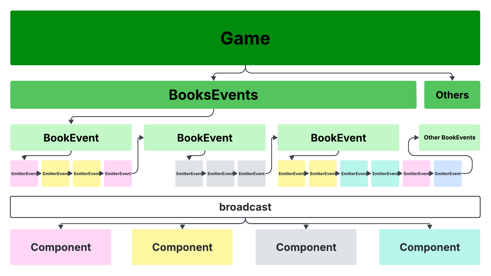

<mark>The colors of the emitterEvents under a bookEvent can be different, which means they are from different svelte components.</mark>

<a name="steps"></a>

# Steps to Add a New BookEvent

For example, we have a game [apps/lines](/apps/lines) already. Assume that we have added a new bookEvent `updateGlobalMult` to the bonus game mode (`MODE_BONUS`) in math, so that we have a new global multiplier feature for the game. Based on that, here we will go through the steps together to implement this new bookEvent and add it to the game. Along the way we will introduce part of our file structure as well.

- [apps/lines/src/stories/data/bonus_books.ts](/apps/lines/src/stories/data/bonus_books.ts): This file includes the an array of bonus books that story `MODE_BONUS/book/random` will randomly pick at. This is to simulate requesting data from RGS. All we need to do is to copy/paste data from our new math package and format it.

```
// bonus_books.ts

{
  type: 'updateGlobalMult',
  globalMult: 3,
},
```

- [apps/lines/src/stories/data/bonus_events.ts](/apps/lines/src/stories/data/bonus_events.ts): This file includes the an object of every type of bookEvent that story `MODE_BONUS/bookEvent/<BOOK_EVENT_TYPE>` uses. All we need to do is to copy/paste data from our new math package and format it.

```
// bonus_events.ts

export default {
  ...,
  updateGlobalMult: {
    type: 'updateGlobalMult',
    globalMult: 3,
  },
  ...,
}
```

- [apps/lines/src/stories/ModeBonusBookEvent.stories.svelte](/apps/lines/src/stories/ModeBonusBookEvent.stories.svelte): This file implements all the sub stories in story set `MODE_BONUS/bookEvent`. With the following code added in this file, you will see the a new story `MODE_BONUS/bookEvent/updateGlobalMult` that is added in our storybook with an `Action` button. Now if we click on it and nothing would happen, but it is a good start because we set up the testing environment first. Next step is to add code of bookEventHandler to handle it.

```
// ModeBonusBookEvent.stories.svelte

<Story
  name="updateGlobalMult"
  args={templateArgs({
    skipLoadingScreen: true,
    data: events.updateGlobalMult,
    action: async (data) => await playBookEvent(data, { bookEvents: [] }),
  })}
/>
```

- [apps/lines/src/game/typesBookEvent.ts](/apps/lines/src/game/typesBookEvent.ts): This file contains typescript types of all the bookEvents. Let is add the type of our new bookEvent to get the intellisense from typescript for the following step.
  - `type BookEvent` is a <mark>union type</mark> ([typescript union type](https://www.typescriptlang.org/docs/handbook/unions-and-intersections.html)) of BookEvent types.

```
// typesBookEvent.ts

type BookEventUpdateGlobalMult = {
  index: number;
  type: 'updateGlobalMult';
  globalMult: number;
};

export type BookEvent =
  | ...
  | BookEventUpdateGlobalMult
  | ...
;
```

- [apps/lines/src/game/bookEventHandlerMap.ts](/apps/lines/src/game/bookEventHandlerMap.ts): This file includes all the bookEventHandlers. Let is add a new one for the new bookEvent. Check the intellisense that the previous step brings, it provides a better developer experience.


###

- [apps/lines/src/components/GlobalMultiplier.svelte](/apps/lines/src/components/GlobalMultiplier.svelte): This file is created as our target svelte component for updateGlobalMulti bookEvent. Technically speaking, all the jobs that is related to global multiplier of the game should only be in this svelte component. Similar to the bookEvent types, let is add the typescript types for new emitterEvents first.
  - `type EmitterEventGlobalMultiplier` is a <mark>union type</mark> of EmitterEvent types.

```
// GlobalMultiplier.svelte

<script lang="ts" module>
  export type EmitterEventGlobalMultiplier =
    | { type: 'globalMultiplierShow' }
    | { type: 'globalMultiplierHide' }
    | { type: 'globalMultiplierUpdate'; multiplier: number };
</script>
```

- [apps/lines/src/game/typesEmitterEvent.ts](/apps/lines/src/game/typesEmitterEvent.ts): This file has typescript types of all the emitterEvents of the game. Let is add the type of our new emitterEvents for intellisense.
  - `type EmitterEventGame` is a <mark>union type</mark> of EmitterEvent types.

```
// typesEmitterEvent.ts

...
import type { EmitterEventGlobalMultiplier } from '../components/GlobalMultiplier.svelte';
...

export type EmitterEventGame =
  | ...
  | EmitterEventGlobalMultiplier
  | ...
;
```

- [apps/lines/src/game/eventEmitter.ts](/apps/lines/src/game/eventEmitter.ts): This file exports the eventEmitter, it uses the `EmitterEventGame` and other EmitterEvent types to compose `type EmitterEvent`.
  - `type EmitterEvent` is a <mark>union type</mark> of EmitterEvent types.

```
// eventEmitter.ts

...
import type { EmitterEventGame } from './typesEmitterEvent';
export type EmitterEvent = EmitterEventUi | EmitterEventHotKey | EmitterEventGame;
export const { eventEmitter } = createEventEmitter<EmitterEvent>();

```

- [apps/lines/src/components/GlobalMultiplier.svelte](/apps/lines/src/components/GlobalMultiplier.svelte): Back to our component file, the intellisense is there. Let is add the code to process the values with a spine animation as well.

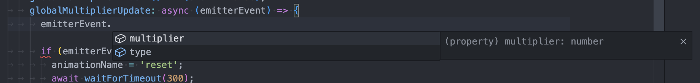

###

```
// GlobalMultiplier.svelte

<script lang="ts" module>
  export type EmitterEventGlobalMultiplier =
    | { type: 'globalMultiplierShow' }
    | { type: 'globalMultiplierHide' }
    | { type: 'globalMultiplierUpdate'; multiplier: number };
</script>

<script lang="ts">
  ...

  context.eventEmitter.subscribeOnMount({
    globalMultiplierShow: () => (show = true),
    globalMultiplierHide: () => (show = false),
    globalMultiplierUpdate: async (emitterEvent) => {
      console.log(emitterEvent.multiplier)
    },
  });
</script>

<SpineProvider key="globalMultiplier" width={PANEL_WIDTH}>
  ...
  <SpineTrack trackIndex={0} {animationName} />
</SpineProvider>
```

- <mark>Test it individually</mark> `(MODE_BONUS/bookEvent/updateGlobalMult)`: Run storybook and we should see this a new story "updateGlobalMult" has been added.

  - Now click on the `Action` button and we should see the [<GlobalMultiplier \/>](/apps/lines/src/components/GlobalMultiplier.svelte) component animates correctly followed by the "<mark> ⓘ Action is resolved ✅ </mark>" message, otherwise we need to go back to the component and figure out what is wrong until it is resolved.

  - If you find out the component hard to debug, we'd better start creating a new story `COMPONENTS/<GlobalMultiplierSpine>/component`. `<GlobalMultiplierSpine />` component will purely take props and achieve its duty instead of being controlled by emitterEvents. This way it becomes more friendly for testing the component with the storybook controls.

- <mark>Test it in books</mark> `(MODE_BONUS/book/random)`: Final step is to test it in a book environment by switching to this book story. In a previous step we have updated [apps/lines/src/stories/data/bonus_books.ts](/apps/lines/src/stories/data/bonus_books.ts), so the new bookEvent will appear if we keep hitting the `Action` button in this story.

<a name="fileStructure"></a>

# File Structure

The file structure is in a way of [structure of TurboRepo](https://turbo.build/repo/docs/crafting-your-repository/structuring-a-repository) to achieve a [monorepo](https://en.wikipedia.org/wiki/Monorepo#:~:text=In%20version%2Dcontrol%20systems%2C%20a,commonly%20called%20a%20shared%20codebase.). Besides the files for the configurations of TurboRepo, sveltekit, eslint, typescript, git and so on, here is a list of of key modules of [apps](/apps) and [packages](/packages).

```
root
  |_apps
  |  |_cluster
  |  |_lines
  |  |_price
  |  |_scatter
  |  |_ways
  |
  |_packages
     |_config-*
     |_constants-*
     |_state-*
     |_utils-*
     |_components-*
     |_pixi-*
```

<a name="apps"></a>

## [/apps](/apps)

For each game, it has an individual folder in the apps, for example [apps/lines](/apps/lines).

- [apps/lines/package.json](/apps/lines/package.json): Find the module name of the app here.

```
{
  "name": "lines",
  ...
}
```

- To run the app in DEV mode instead of in the storybook: Run `pnpm run dev --filter=<MODULE_NAME>` in the terminal.

```
pnpm run dev --filter=lines
```

- [apps/lines/src/routes/+page.svelte](/apps/lines/src/routes/%2Bpage.svelte): This is the entry file of sample game apps/lines in a sveltekit way. It is a combination of two things:
  - [setContext()](/apps/lines/src/game/context.ts#L14): A function that sets all the [svelte-context](https://svelte.dev/docs/svelte/context) required and used in this app and in the [packages](/packages). As we already know, only children-level components can access the context. That is why we set the context at the entry level of the app.
  - [<Game \/>](/apps/lines/src/components/Game.svelte): The entry svelte component to the game. It includes all the components of the game.

```
// +page.svelte

<script lang="ts">
  import Game from '../components/Game.svelte';
  import { setContext } from '../game/context';

  setContext();
</script>

<Game />
```

- [apps/lines/src/stories/ComponentsGame.stories.svelte](/apps/lines/src/stories/ComponentsGame.stories.svelte): You will find the same pattern in this storybook or other `Mode<GAME_MODE>Book.stories.svelte` and `Mode<GAME_MODE>BookEvent.stories.svelte`.

```
// ComponentsGame.stories.svelte

<script lang="ts">
  ...
  import Game from '../components/Game.svelte';
  import { setContext } from '../game/context';

  ...
  setContext();
</script>

<Story name="component (loadingScreen)">
  <StoryLocale lang="en">
    <Game />
  </StoryLocale>
</Story>
```

- We can render [<Game \/>](/apps/lines/src/components/Game.svelte) component in the app or in the storybook. Either way it requires the context to set in advance, otherwise the children or the descendants will throw errors if they use the ["getContext()"](/apps/lines/src/game/context.ts#L21) from [apps](/apps) or ["getContext()"](/packages/components-ui-pixi/src/context.ts#L8) from [packages](/packages).

<a name="packages"></a>

## [/packages](/packages)

For every TurboRepo local package, you can import and use them in an app or in another local package directly without publishing them to [npm](https://www.npmjs.com). <mark>Our codebase benefits considerably from a monorepo because it brings reusability, readability, maintainability, code splitting and so on.</mark> Here is an example of importing local packages with `workspace:*` in [apps/lines/package.json](/apps/lines/package.json):

```
// package.json

{
  "name": "lines",
  ...,
  "devDependencies": {
    ...,
    "config-ts": "workspace:*",
  },
  "dependencies": {
    ...,
    "pixi-svelte": "workspace:*",
    "constants-shared": "workspace:*",
    "state-shared": "workspace:*",
    "utils-shared": "workspace:*",
    "components-shared": "workspace:*",
  }
}
```

The naming convention of packages is a combination of `<PACKAGE_TYPE>`, hyphen and `<SPECIAL_DEPENDENCY>` or `<SPECIAL_USAGE>`. For example, `components-pixi` is a local package that the package type is "components" and the special dependency is `pixi-svelte`.

- `config-*`:
  - [config-lingui](/packages/config-lingui): This local package contains reusable configurations of npm package [lingui](https://www.npmjs.com/package/@lingui/core).
  - [config-storybook](/packages/config-storybook): This local package contains reusable configurations of npm package [storybook](https://www.npmjs.com/package/storybook).
  - [config-svelte](/packages/config-svelte): This local package contains reusable configurations of npm package [svelte](https://www.npmjs.com/package/svelte).
  - [config-ts](/packages/config-ts): This local package contains reusable configurations of npm package [typescript](https://www.npmjs.com/package/typescript).
  - [config-vite](/packages/config-vite): This local package contains reusable configurations of npm package [vite](https://www.npmjs.com/package/vite).
- `pixi-*`
  - [pixi-svelte](/packages/pixi-svelte): This local package contains reusable svelte components/functions/types based on [pixijs](https://www.npmjs.com/package/pixi.js) and [svelte](https://www.npmjs.com/package/svelte).
    - It creates `stateApp` and `ContextApp` as a [svelte-context](https://svelte.dev/docs/svelte/context).
    - It also builds and publishes [pixi-svelte of npm](https://www.npmjs.com/package/pixi-svelte).
  - [pixi-svelte-storybook](/packages/pixi-svelte-storybook): This is a storybook for components in `pixi-svelte`.
- `constants-*`:
  - [constants-shared](/packages/constants-shared): This local package contains reusable <mark>global</mark> constants.
- `state-*`:
  - [state-shared](/packages/state-shared): This local package contains reusable <mark>global</mark> [svelte-$state](https://svelte.dev/docs/svelte/$state).
- `utils-*`:
  - [utils-book](/packages/utils-book): This local package contains reusable functions/types that are related to book and bookEvent.
  - [utils-fetcher](/packages/utils-fetcher): This local package contains reusable functions/types based on [fetch API](https://developer.mozilla.org/en-US/docs/Web/API/Fetch_API).
  - [utils-shared](/packages/utils-shared): This local package contains reusable functions/types, except for [lodash](https://www.npmjs.com/package/lodash) and [lingui](https://www.npmjs.com/package/@lingui/core).
  - [utils-slots](/packages/utils-slots): This local package contains reusable functions/types for slots game, for example creating reel and spinning the board.
  - [utils-sound](/packages/utils-sound): This local package contains reusable functions/types based on npm package [howler](https://www.npmjs.com/package/howler) for music and sound effect.
  - [utils-event-emitter](/packages/utils-event-emitter): This local package contains reusable functions/types to achieve our [event-driven programming](https://en.wikipedia.org/wiki/Event-driven_programming).
    - It creates `eventEmitter` and `ContextEventEmitter` as a [svelte-context](https://svelte.dev/docs/svelte/context)
  - [utils-xstate](/packages/utils-xstate): This local package contains reusable functions/types based on npm package [xstate](https://www.npmjs.com/package/xstate).
    - It creates `stateXstate`, `stateXstateDerived` and `ContextXstate` as a [svelte-context](https://svelte.dev/docs/svelte/context)
  - [utils-layout](/packages/utils-layout): This local package contains reusable functions/types for our layout system of pixijs.
    - It creates `stateLayout`, `stateLayoutDerived` and `ContextLayout` as a [svelte-context](https://svelte.dev/docs/svelte/context)
- `components-*`:
  - [components-layout](/packages/components-layout): This local package contains reusable svelte components based on another local package `utils-layout`.
  - [components-pixi](/packages/components-pixi): This local package contains reusable svelte components based on `pixi-svelte`.
  - [components-shared](/packages/components-shared): This local package contains reusable svelte components based on `html`.
  - [components-storybook](/packages/components-storybook): This local package contains reusable svelte components for storybooks.
  - [components-ui-pixi](/packages/components-ui-pixi): This local package contains reusable svelte pixi-svelte components for the game UI.
  - [components-ui-html](/packages/components-ui-html): This local package contains reusable svelte html components for the game UI.

For `*-shared` packages, they are created to be reused as much as possible by other apps and packages. Instead of having a special dependency or usage, they should have a minimum list of dependencies and a broad set of use cases.

`pixi-svelte`, `utils-event-emitter`, `utils-layout` and `utils-xstate` they have functions to create corresponding [svelte-context](https://svelte.dev/docs/svelte/context). For the contexts, they can be used by either an app or a local `components-*` package by just calling the `getContext<CONTEXT_NAME>()`. For example, components in `components-layout` use `getContextLayout()` from `utils-layout`. In this way, we can regard `pixi-svelte` as an integration of "utils-pixi-svelte" and "components-pixi-svelte".

<a name="context"></a>

# Context

[svelte-context](https://svelte.dev/docs/svelte/context) is a useful feature from svelte especially when a shared state requires some inputs/types to create. Here it shows the structure of context of sample game [apps/lines](/apps/lines). As showed before, `setContext()` is called at entry level component. For example, [apps/lines/src/routes/+page.svelte](/apps/lines/src/routes/%2Bpage.svelte) or [apps/lines/src/stories/ComponentsGame.stories.svelte](/apps/lines/src/stories/ComponentsGame.stories.svelte). It sets four major contexts from the packages by this:

```
// context.ts - Example of setContext in apps

export const setContext = () => {
  setContextEventEmitter<EmitterEvent>({ eventEmitter });
  setContextXstate({ stateXstate, stateXstateDerived });
  setContextLayout({ stateLayout, stateLayoutDerived });
  setContextApp({ stateApp });
};
```

<mark>Different apps and packages require different contexts.</mark>

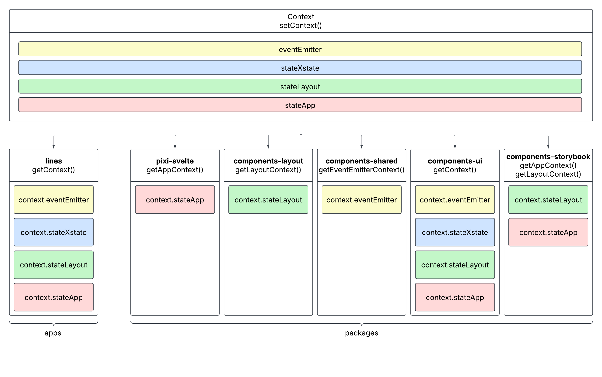

<a name="contextEventEmitter"></a>

## ContextEventEmitter

`eventEmitter` is created by [packages/utils-event-emitter/src/createEventEmitter.ts](/packages/utils-event-emitter/src/createEventEmitter.ts). We have covered eventEmitter in the [previous content](#eventEmitter).

<a name="contextLayout"></a>

## ContextLayout

`stateLayout` and `stateLayoutDerived` are created by [packages/utils-layout/src/createLayout.svelte.ts](/packages/utils-layout/src/createLayout.svelte.ts). It provides canvasSizes, canvasRatio, layoutType and so on. Because we have a setting `resizeTo: window` for PIXI.Application, we use the sizes of window from [svelte-reactivity](https://svelte.dev/docs/svelte/svelte-reactivity-window) as `canvasSizes`.

For html, the tags will auto-flow by default. However, in the canvas/pixijs we need to set positions manually to avoid overlapping. The importance of LayoutContext is that it provides us the values of boundaries (canvasSizes), device type based on the dimensions (layoutType) and so on. For example:

- Set a pixi-svelte component to the left edge of the canvas:
  - `<Component x={0} />`
- Set a pixi-svelte component to the right edge of the canvas:
  - `<Component x={context.stateLayoutDerived.canvasSizes().width} anchor={{ x: 1: y: 0 }} />`
  - It works when `<App />` is the parent of the component, otherwise it will be determined by its parent `<Container />`.
  - The reason why we set `anchor` is because that the drawing is always go from top-left to bottom-right in pixijs.

```
// createLayout.svelte.ts

import { innerWidth, innerHeight } from 'svelte/reactivity/window';

...

const stateLayout = $state({
  showLoadingScreen: true,
});

const stateLayoutDerived = {
  canvasSizes,
  canvasRatio,
  canvasRatioType,
  canvasSizeType,
  layoutType,
  isStacked,
  mainLayout,
  normalBackgroundLayout,
  portraitBackgroundLayout,
};
```

<a name="contextXstate"></a>

## ContextXstate

`stateXstate` and `stateXstateDerived` are created by [packages/utils-xstate/src/createXstateUtils.svelte.ts](/packages/utils-xstate/src/createXstateUtils.svelte.ts). It provides a few functions to check the state of [finite state machine](https://en.wikipedia.org/wiki/Finite-state_machine), also known as `gameActor`, which is created by [packages/utils-xstate/src/createGameActor.svelte.ts](/packages/utils-xstate/src/createGameActor.ts).

```
// createXstateUtils.svelte.ts

import { matchesState, type StateValue } from 'xstate';

...

const stateXstate = $state({
  value: '' as StateValue,
});

const matchesXstate = (state: string) => matchesState(state, stateXstate.value);

const stateXstateDerived = {
  matchesXstate,
  isRendering: () => matchesXstate(STATE_RENDERING),
  isIdle: () => matchesXstate(STATE_IDLE),
  isBetting: () => matchesXstate(STATE_BET),
  isAutoBetting: () => matchesXstate(STATE_AUTOBET),
  isResumingBet: () => matchesXstate(STATE_RESUME_BET),
  isPlaying: () => !matchesXstate(STATE_RENDERING) && !matchesXstate(STATE_IDLE),
};
```

`gameActor`: To avoid using massive "if-else" conditions in the code, we use [npm/xstate](https://www.npmjs.com/package/xstate) to create a [finite state machine](https://en.wikipedia.org/wiki/Finite-state_machine) to handle the complicated logic and states of betting. It provides a few pre-defined mechanics like one-off `bet`, `autoBet` with a count down, `resumeBet` to continue an unfinished bet and so on.

```
// createGameActor.svelte.ts

import { setup, createActor } from 'xstate';

...

const gameMachine = setup({
  actors: {
    bet: intermediateMachines.bet,
    autoBet: intermediateMachines.autoBet,
    resumeBet: intermediateMachines.resumeBet,
  },
}).createMachine({
  initial: 'rendering',
  states: {
    [STATE_RENDERING]: stateRendering,
    [STATE_IDLE]: stateIdle,
    [STATE_BET]: stateBet,
    [STATE_AUTOBET]: stateAutoBet,
    [STATE_RESUME_BET]: stateResumeBet,
  },
});

const gameActor = createActor(gameMachine);
```

<mark>This is highly useful when it comes to the interactions with UI, for example disable the bet button when the a game is playing.</mark>

```
// BetButton.svelte - Example of interaction between xstate and UI

<script lang="ts">
  import { getContext } from '../context';

  const context = getContext();
</script>

<SimpleUiButton disabled={context.stateXstateDerived.isPlaying()} />
```

<a name="contextApp"></a>

## ContextApp

`stateApp` is created by [packages/pixi-svelte/src/lib/createApp.svelte.ts](/packages/pixi-svelte/src/lib/createApp.svelte.ts). `loadedAssets` contains the static images, animations and sound data that is processed by `PIXI.Assets.load` with `stateApp.assets`. `loadedAssets` can be digested by pixi-svelte components directly as showed in pixi-svelte component [\<Sprite /\>](/packages/pixi-svelte/src/lib/components/Sprite.svelte).

```
// createApp.svelte.ts

const stateApp = $state({
  reset,
  assets,
  loaded: false,
  loadingProgress: 0,
  loadedAssets: {} as LoadedAssets,
  pixiApplication: undefined as PIXI.Application | undefined,
});
```

<a name="ui"></a>

# UI

We have provided solutions for the UI, which are [components-ui-pixi](/packages/components-ui-pixi) and [components-ui-html](/packages/components-ui-html). They are functional with a few features like auto gaming, turbo mode, bonus button, responsiveness and so on, although they are not as beautiful.

```
<script lang="ts">
	import { UI, UiGameName } from 'components-ui-pixi';
	import { GameVersion, Modals } from 'components-ui-html';
</script>

<App>
  <UI>
    {#snippet gameName()}
      <UiGameName name="LINES GAME" />
    {/snippet}
    {#snippet logo()}
      <Text
        anchor={{ x: 1, y: 0 }}
        text="ADD YOUR LOGO"
        style={{
          fontFamily: 'proxima-nova',
          fontSize: REM * 1.5,
          fontWeight: '600',
          lineHeight: REM * 2,
          fill: 0xffffff,
        }}
      />
    {/snippet}
  </UI>
</App>

<Modals>
	{#snippet version()}
		<GameVersion version="0.0.0" />
	{/snippet}
</Modals>

```

For the branding purpose, we recommend you to regard them as just an example of UI packages instead of applying them directly to your final product. It would be a good choice to use them as a starting point and add more style to them to build your UI. It is completely fine to ignore them and build your own UI from scratch.

<a name="internationalisation"></a>

# Internationalisation ([i18n](http://www.i18nguy.com/origini18n.html))

To be continued.